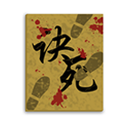

# “诀死行者” 名字的由来

这张图片是我自己设计的，名字和图片是一起出来的，想到这名字的时候脑子里就已经蹦出这图片的模样，就马上打开 PS 画出来。这名字也不是凭空想出来的，它蕴含着一个让人难忘的经历。下面我先讲讲这段经历，再讲讲这个名字的含义，不想听故事的可以直接跳到最后一段。

在我本科即将毕业的那一学期，具体时间是2018年3月5日我独自一人去广州找工作。去广州不是为了说想去大城市发展，而是为了履行当初许下的诺言，至于为什么是独自一人，那是个意外。

作为乡下村里出来的人来说，一个人去大城市真的是需要很大的勇气和决心。我平时很宅，很少出去走动，到了一个陌生的地方就很容易迷路，看着地图都走不明白。也没自己租过房，之前的房子都是跟朋友一起找的。也没去过外省，我是泉州人，去过最远的地方是厦门，第一次来厦门也是跟别人一起的。这样的我要独自一人去广州，这不就是在自寻死路吗。

而且去广州没有直达车，还坐动车，再转另外一辆动车，再转地铁。我这个平时都是坐大巴的，都很少坐动车，就算有坐动车也都是有人一起的。而我这次要一个人坐动车，还要转另一辆动车，我都不知道怎么转。而且还要转地铁，我平生就没见过地铁，长什么样都不知道，买票流程也不知道。

最最可怕的是到了广州没人可以接应我，那边一个朋友都没有，我这个没有自己找过房子的人，现在要一个人到陌生的城市里当天就要找到房子住下（住不起酒店），还是带着行李找。

最最最可怕的是，去的当天深圳到广州的动车停运了，已经那么难了还给我增加难度。听到停运的消息我就赶快找其他路动车，结果没有一辆有到的了。又去找了客运车，全部的没票了，车站也没有。然后我就赶紧叫顺风车，等了好久都没人接，路边全都站满了人都在叫车，根本叫不到，急得都快哭出来了。最后终于找到了私家车可以坐了，虽然价格翻倍。到了广州已经是晚上了，我还得找房子。

所幸我这次没有迷路，房子也找的很顺利，最后总算是住了下来。我居然挺过来的，真是不容易，洗漱完趴下立马就睡着了，好久没有睡得那么香了。

之前已经是约好面试了，第二天醒来就去凡科面试了。在这大城市里，看什么都觉得很新鲜。在去面试的路上看遍了广州风采，原来坐地铁那么方便的，原来公交站可以那么长。当时我就突然想到了电视里的一个词——“修行者”。感觉这里就是个江湖，我是个修行者游历于此处。

第一家的面试果然还是失败了，给我的第一感觉就是：为什么不看我作品（在厦门找工作基本每一家都喜欢看你作品），亏我还准备了一堆作品，笔记本都带过去了都开起来了就是不看作品。然后就是问我一堆原理问题，之前没注意过这类问题有些还真答不上来。回去后就狂刷面试题。然后让人很绝望的事情发生了，一整周都没接到面试通知，我问了朋友和前同事，我的简历没问题呀。而且我还降低要求的找，找的是应届生的工作。奇怪！难道是本科学历不够看？学校太没名次？对哦！这里是广州，人很多，又有很多好学校的。难道是因为学历学校被人事部刷掉了？一周后陆续有收到简历，但都是些小公司，好像就是学历学校的问题。那些小公司去面试的感觉都挺好的，最后都没收到 offer 。有一家给我回复说不要应届生，这也成为了我安慰自己的理由。

一直没找到工作让我心情很低沉，这里也没有一个认识的人，感觉特别的空虚。这就是空巢青年吗？之前看电视讲这类人有多么不容易，现在我终于能体会到了。不行！不能再继续低沉下去，我可是别人眼中的大佬，我怎么能这么轻易的就被打倒呢！我都能一个人来到这里了，还有什么是我做不到的。既然决定走这条路了，就要坚持下去，一条路走到黑。

我可是一名修行者，不对！我是修行者那我修行什么？JavaScript？对哦！现在前端可以写网页，可以写 APP ，可以写桌面应用，而且都是用 JS 写的。我修行的不就是 JS 吗。不过 JS 太洋气了，没有那种绝世高手的感觉，得换个名字。等等，JS 好像可以用音译字，“诀死”！可以可以！修行秘诀的 “诀”，一条路走到黑走到死的 “死” ，那我就是一名 “诀死” 的行修者，合起来就是 “诀死行者” ，好像还不错哦！然后我就想到了一个画面，干脆就画成一个 logo 。这修行秘诀应该是一本武功秘籍的样子，这条修行之路很不容易，应该会走过很多路，所以这本秘籍应该沾满了泥土，还要再踩上几脚。然后这本秘籍这么厉害应该很多人抢，应该经过了很多腥风血雨，所以应该要沾上几滴血，这对 “死” 字才更贴切。这就是这个名字和这张图的由来。