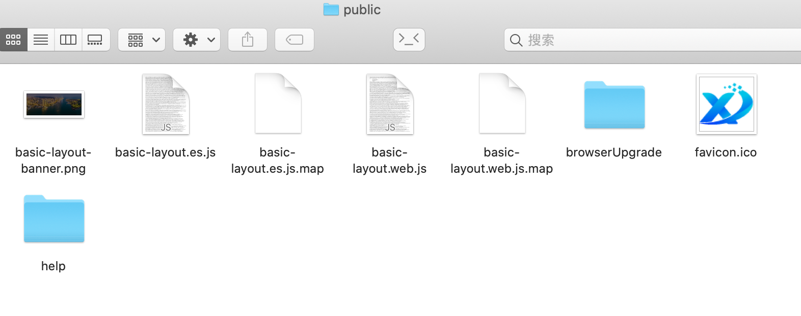
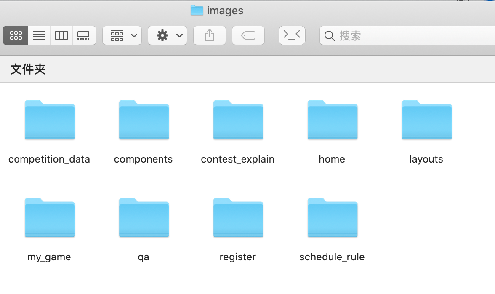
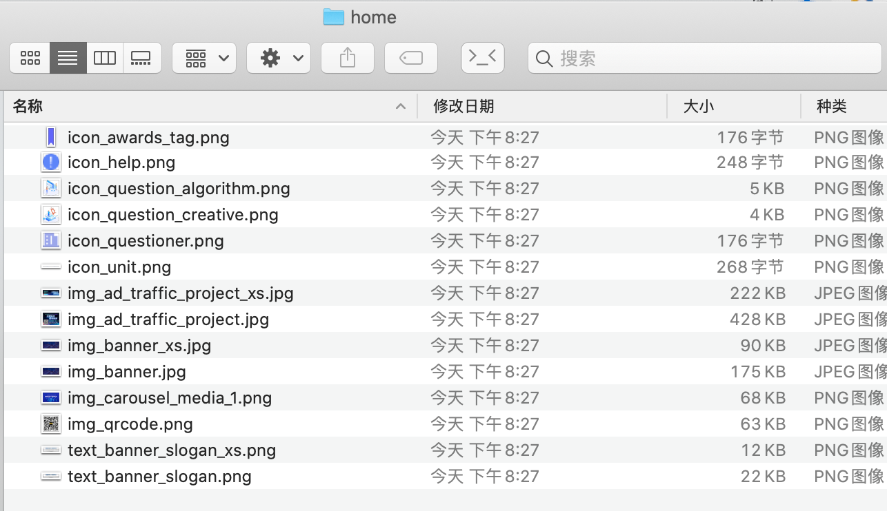
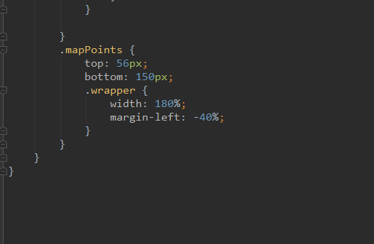
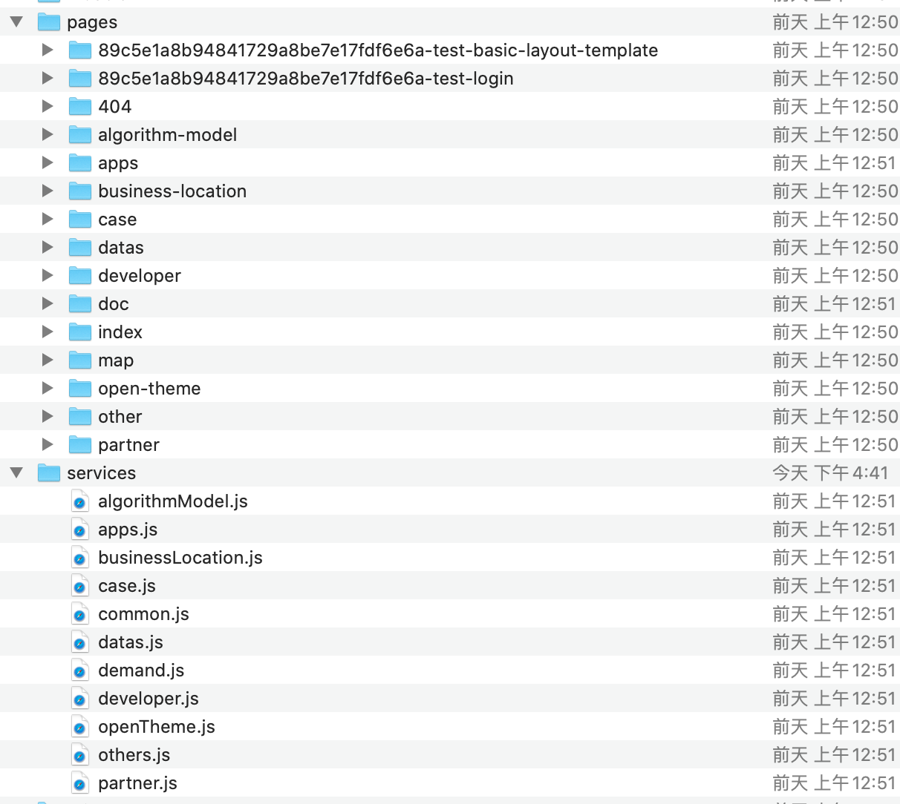
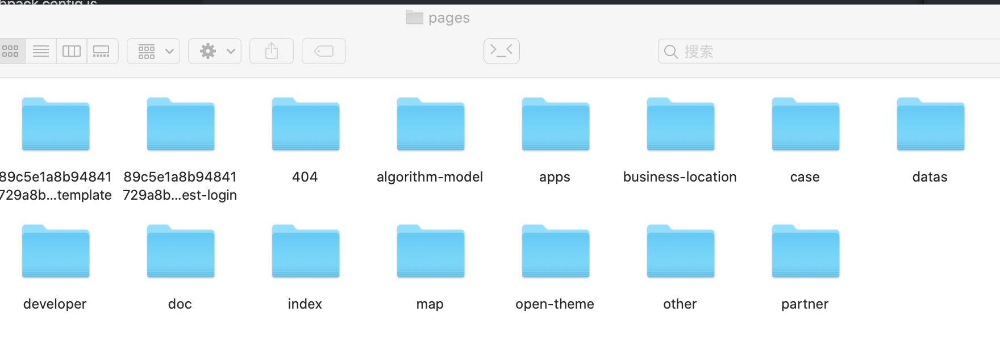
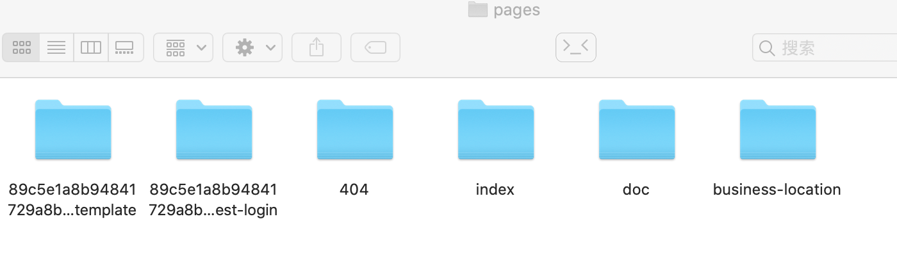

# 公司脚手架项目实战分享

> 文章编写时间：2020-06-03

在这项目的开发过程中一直在不断的完善项目结构，在脚手架的实践方面是最能体现经验的。对这脚手架用了也有一年多了，有了更深一层的理解。这次结合我们项目的实践更深层的去讲解这个脚手架。

我们先来重新认识下脚手架，这次就只讲 [`mpa` 模板](./share-demo)，这也是最常用、最基础的一个模板：

```
|+ public/              存放不需要编译转码的文件
|- src/
|   |+ assets/          资源文件
|   |+ components/      公共组件
|   |+ config/          配置文件
|   |+ layouts/         布局组件
|   |+ models/          dva model定义文件
|   |+ pages/           页面文件
|   |+ services/        网络请求
|   |+ utils/           工具类
|   |- theme.js
|
|- .editorconfig
|- .eslintignore
|- .eslintrc
|- .gitignore
|- .npmrc
|- .prettierrc
|- package.json
|- webpack.config.js
|- yarn.lock
```

这个模板只做了大体分类，而里面的具体内容分类才是这次要讲的重点，后面将一个目录一个目录的讲下去。

最终改造后的模板已放在放在 [opendata-demo](./opendata-demo) 。

## webpack.config.js

在讲解那些目录之前，有必要讲解下这个文件。这文件名字虽然是这样叫，但跟 webpack 的配置规则还是有些差别。

我们执行 `yarn start` 的时候不是启动 webpack ，而是执行 `sharekit server` 。这个 sharekit 是公司自己封装的一套配置，执行命令行后是将远端的一套配置和当前项目的 webpack.config.js 进行合并，webpack 识别的是合并后的配置。所以 webpack.config.js 的配置规则需要查阅的文档是 [sharekit 文档](http://192.168.0.184:20000/share-tools/share-kit) 。

## public

存放不需要编译转码的文件，可能有些人不能理解这句话，所以有必要说下脚手架是怎么处理这个文件夹的。这个文件夹有点特殊，项目执行 yarn build 进行打包的时候 webpack 不会对这个文件夹里的内容做任何处理，只会原封不动的拷贝到打包文件夹里面，比如我们在 public里面加了这些文件：
      


如果我们把包编译到 dist 文件夹，那我们就能在 dist 里面找到对应的文件，文件名没做任何处理，目录结构也是一样的：

 

这就意味着文件访问路径是已经确定下来了，也就是说你可以使用绝对路径去访问这些文件。由此就会有以下几种应用场景：

1. 不能通过模块化引入的。比如 index.html 文件需要访问项目logo，那我就可以这样写：

```html
<link rel="shortcut icon" href="/文根/favicon.ico" />
```

2. 非本项目使用，而是提供给其他项目或者第三方平台使用。比如我们这个数据开放平台，我们这个项目是跟托尔通（其他公司）合作的，他们开发安全屋的部分，也是系统里的一部分。同一个系统界面风格要一样，我们方案是将公共头部和底部的代码和样式打包成一个 JS 文件给他们引入。这就变成代码由我们这边维护，而使用者是在第三方应用那边。
3. 更新频繁的文件。比如有些文档文件，文档内容还不完善，经常要经常改动，不想要每次修改文档就重新发个包。放在 public 里面就可以针对性的只更换一个文件，这样他们就可以自己替换，不需要我们前端干预。
4. 不需要编译的 JS 文件。比如 Web Worker 文件，这文件的运行环境不同于普通的 JS 文件，用 babel 去编译其实是会报错的。Web Worker 有内置了一些变量和方法，比如 self 、onmessage ，这些是可以直接使用的，但是 babel 去编译的时候会报变量未定义。其实这个报错是可以无视掉的，是可以正常使用的。

目前我们项目遇到的就这4种场景，如果你们有遇到不同场景的可以提出来，我来汇总，一起完善我们脚手架的文档。

## assets

存放资源文件的地方。

```
|- assets/
     |+ fonts/
     |+ icons/
     |+ images/
```

默认模板把 assets 目录展开长这样。

### fonts

存放字体文件。

用到字体文件一般是打算使用字体图标，这边放的应该是除了 @share/shareui-font 以外的字体图标文件。用到字体图标的时候应该优先从 @share/shareui-font 里面找，找不到再跟设计师反馈一下。一般情况要么给你加上去，要么推荐你用其他类似的图标，很少需要自己去别的地方找，所以这个文件夹里面一般是空的。

### icons

存放图标文件。

这个文件夹我觉得没有存在的必要，图标一般会有这几种，字体图标、ico、png、svg、webp。字体图标应该放在 fonts 文件夹里面，png、webp 应该放在 images里面，svg 我觉得可以独立一个目录出来，ico 就只有 index.html 里面才会用得到，放这边也访问不到。

### images

存放图片文件。

存放的图片格式应该是这几种：jpg、png、webp，出现其他格式应考虑是否可以转下格式或者放在其他目录，比如 jpng 应该转成 jpg ，svg 文件应该独立为一个目录。关于图片问题有几点需要注意的：

**1. jpg、png、webp 这三种格式的如何选择？**

移动端页面应该优先考虑使用 webp ，移动端处于弱网络的情况会比较多，应该尽可能的减小资源大小，而 webp 是尺寸最小的一种，在移动端兼容性也是比较好，所以尽可能的使用 webp ，这个现在脚手架还不支持，得让他们尽快集成进去。

对于 PC 端，IE 不支持 webp ，所以需要考虑 IE 的项目只能选择 jpg 或 png 。这两种格式也是有讲究的，jpg 的文件大小会比 png 小很多，如果图片没有透明度的话，优先选择 jpg 。

**2. 图片压缩问题**

我们现在用的脚手架是没有图片压缩的配置的，我切出来的图多大，打包后的图就有多大。图片压缩的配置希望能尽快集成进脚手架里面。我们现在都是手动压缩，到 [TinyPNG](https://tinypng.com/) 上面压缩完下载下来。

**3. 文件管理问题**

随着项目不断壮大，图片会越来越多，全部文件放在一个文件夹里面就会很乱，文件不好找。我们是根据功能模块去划分，一个模块一个文件夹，如下：



公共组件用到的图片作为单独一个文件夹，布局组件也作为单独一个文件夹，其他是一个页面对应一个文件夹。这是个专题系统，界面设计比较炫酷，所以每个页面图片都比较多。如果是图片少了，像管理系统那种，就建议按照模块划分。

不管是模块划分还是页面划分，都功能模块的划分。同一个功能也是会存在很多图片，所以还需要做一层图片类型分类，如下：



图片大体分为三种：图标 (icon)、图像 (img)、文本 (text)。

- 图标一般是那种具有标志性的图形、logo。

- 文本就是图片里面只有文字的，一般是使用了特殊字体的才会用图片。

- 图像就是非图标和文本的都认为是图像。

做这个命名分类主要是为了图片好找，有时候要改图片，需要看下图片的尺寸或者想要取相同名字进行覆盖。


以上是脚手架自带的三个文件夹，我还加了一个 styles 目录

### styles

存放全局样式的文件。

把全局样式放在 assets 里面存着一些争议性，既然当初这样定了就先这样了，你也可以考虑把这个文件夹放在 src 下。

我们项目自始至终一直就只有两个文件：`public.scss` 和 `variables.scss` ，一个的全局样式、一个是全局变量集。

**1. public.scss**

这个文件将会在每个多页模块的入口里引入，将作用于每一个页面。

我们在这个文件里面放的代码主要是这些：

- 浏览器默认样式的重置代码。
- shareui 部分样式重置代码。因为我们定的项目设计规范跟 shareui 有些不一样。
- 样式封装。有些地方感觉封装成组件会有点没必要，因为内容太少，重心是在样式那边，所以就干脆封装样式就好了。

**2. variables.scss**

这个文件主要存放一些 scss 变量，我截取了其中一段代码，如下：

```scss
$color-text1-4: #323538;   // 标题
$color-text1-3: #65686d;   // 正文
$color-text1-2: #a4a5a9;   // 提示
$color-text1-1: #d0d1d4;   // 禁用

$color-line1-2: #ebeced;   // 边框
$color-fill1-1: #f7f8f9;   // 背景

$color-success-3: #00bb88; // 成功
$color-error-3: #ff6655;   // 失败
$color-warning-3: #ffaa33; // 警告
```

这是一些主题色变量，是跟设计师约定好的一套规范。这些变量名称与设计那边的[颜色谱](https://fusion.design/74436/design/style/color)保持一致，如果是开发使用可以进一步再定义一些变量，如下：

```scss
$color-text-title:    $color-text1-4;    // 标题文本色
$color-text-desc:     $color-text1-3;    // 描述文本色
$color-text-tip:      $color-text1-2;    // 提示文本色
$color-text-disabled: $color-text1-1;    // 禁用文本色

$color-line:          $color-line1-2;    // 线框颜色
$color-fill:          $color-fill1-1;    // 背景填充色
```

除此之外还约定好了以下几点：

- 边距大小都是 4 的倍数
- 文本行高单行是 1.3 ，多行是 1.5

有了这些约定开发起来会快很多，看着设计图就能看出使用的是哪个颜色值，边距是多少，而不用一个个去看标注，也不用每个都去复制颜色值，大多数情况就只会用到这些，对于少部分的解决手段后面的内容会讲。

如果要使用这些变量，是需要 import 引入这个文件才能使用，每个文件都这样引入会很麻烦，有一个插件可以解决这个问题，那就是 `sass-resources-loader` ，你需要 npm 安装这个模块，然后修改 webpack.config.js ：

```js
module.exports = {
  // ...
  extraRules: [
    // ...
    {
      test: /\.scss$/,
      include: path.resolve(__dirname, './src'),
      exclude: path.resolve(__dirname, './src/assets/styles/variables.scss'),
      enforce: 'pre',
      use: [
        {
          loader: 'sass-resources-loader',
          options: {
            resources: './src/assets/styles/variables.scss',
          },
        },
      ],
    },
  ]
  // ...
}
```

这个配置会帮你在所有 src 下的 scss 文件（排除 `variables.scss` 文件）都加上引入 `variables.scss` 文件的代码。

这样就可以直接使用这些变量，而且还有代码提示，如下面这张动图：



以上就是我们项目对 assets 资源目录的实践。

## components

存放公共组件的地方。

```
|- components/
     |+ business/
     |+ ui/
```

默认模板把 components 目录展开长这样。

组件分成 business 和 ui 两种类型的组件，当初的设定是 business 存放的是带有逻辑业务的组件，而 ui 只存放存纯视图的组件。其实这个方案早就被否决掉了，只是模板没有去更新。因为开发了一段时间发现真正纯视图的组件很少。也许当下是一个纯视图组件，但往往后续的需求变更就会让这些纯视图组件变得不再单纯。你还得花时间去思考，我该如何守护你的单纯，最后往往会改成 business 组件。所以这样分类毫无意义，你可以把这两个文件夹删掉，直接放在 components 下。

经过这段时间的实践得出以下几个结论：

- 不存在永远是纯视图的组件，你可以认为每个组件都会逻辑，即使现在没有，将来也会有。
- 永远不要想着去分离逻辑与视图，这样开发起来会很累，维护起来也很累，唯一的好处就是组件代码变简洁了，但逻辑代码还是很多。个人认为比较好的做法是封装逻辑，而不是分离逻辑。

具体如何写组件将在后续的分享会上章节讲解，接下来讲解下组件文件管理。

我们先来看看默认模板的组件是怎么写的：

```
|- components/
      |- business/
      |     |- UserListA/
      |     |     |- index.js
      |     |     |- UserLiseA.js
      |     |     |- UserListA.scss
      |     |+ UserListB/
      |
      |+ ui/
```

组件以文件夹的形式存在，一个文件夹对应一个组件，组件文件和样式文件都与文件夹同名，每个文件夹底下都要有一个 index.js 文件用来映射组件文件。这是当年推荐的写法，经过实践，这种组织方式确实很实用，我到现在还是以这种方式去写组件。我在这基础上又进一步完善了下。主要从组件结构和代码规范两方面去完善。

### 组件结构

```
- Example/
   |- Example.js
   |- index.js
```

这是组件最基本的结构，每个组件都要有单独的文件夹来管理，且文件夹名称与组件同名，命名风格要使用大驼峰写法。每个文件夹下都要有个 index.js 用来映射组件。再简单的组件都要遵守这种结构，一方面是保证代码结构一致性，另一方面为了应对不断变化的需求，现在简单不代表将来也简单。

脚手架模板的 index.js 写了两行代码，其实还可以再简化，可以简单的一句解决：

```js
export { default } from './Example';
```


如果组件里还拆分出子组件，就在组件所在目录建一个 components 文件夹存放，子组件同样要遵守组件规范。如果子组件是很多组件公用的，就提到公共组件（ /src/component ）里面。如果组件用到图片（非公用的），就在组件所在目录建一个images文件夹存放。组件内使用到 scss ，如果这些样式只作用于该组件，就要建一个 scss 文件，在组件所在目录下创建，名字与组件同名，最终的结构如下：

```
- Example/
   |- components/
   |    |- Children1/
   |    |     |- Children1.js
   |    |     |- index.js
   |    |- Children2/
   |          |- Children2.js
   |          |- index.js
   |
   |- images/
   |    |- logo.png
   |- Example.js
   |- Example.scss
   |- index.js
```


组件内可能会设置一些配置文件，或者设置一些非公共的工具方法，或者抽离出来的逻辑代码，就放在 logic 目录下，如下：

```
- Example/
   |+ components/
   |+ images/
   |- logic/
   |    |- config.js
   |    |- utils.js
   |    |- useLogic.js
   |- Example.js
   |- Example.scss
   |- index.js
```

如果逻辑代码比较少，也可以直接写一个 logic.js 文件，如下：

```
- Example/
   |+ components/
   |+ images/
   |- logic.js
   |- Example.js
   |- Example.scss
   |- index.js
```

### 代码规范

在 ESLint 的基础上我又定了几点规范。规范其实就是约束，约束多了其实是会影响开发效率，所以我定的规范会尽可能少。在我们项目规范的基础上又删减了一些，只剩下下列三条。

1. 一个文件里只能有一个组件，且文件名与组件名一致。
2. 文件导入顺序。定这条规范是因为看过太多的代码一团乱，改别人的代码其实很经常需要看这一块，如果做好分类有序排放是能很清晰的看出你用了哪些技术，对维护代码是很有帮助的。

   ```js
   // scss
   import styles from './Example.scss';
   
   // react系列
   import React, { useState, useEffect } from 'react';
   import { useHistory } from 'react-router';
   import { useSelector } from 'react-redux';
   
   // 组件，第三方组件 > 公司私库 > 布局组件 > 最外层公共组件 > 模块公共组件 > 子组件
   import { Spin } from 'antd';
   import { Button } from '@share/shareui';
   import BasicLayout from '@/layouts/BasicLayout';
   import Header from '@/components/Header';
   import Children from './components/Children';
   
   // 网络请求方法
   import { findProjectList } from '@/server/safeOpen';
   
   // 配置文件
   import { PROJECT_STATUS } from '@/config/status';
   import { mapProjectStatus } from '@/config/typeMap';
   
   // 工具类，第三方库 > 公共工具类 > 局部工具类
   import _ from 'lodash';
   import cx from 'classnames';
   import { getUrlSearch } from '@/utils';
   
   // 逻辑代码
   import { defaultFormData, useLogic } from './logic';
   
   // 资源文件
   import logoImg from '@/assets/images/logo.png';
   import bannerImg from './images/banner.png';
   ```

5. 条件状态判断时不允许与数值直接做判断。一方面增加可读性，另一方面统一管理更能应对需求的变更。

   ```js
   // 坏的
   if (data.projectStatus === '20') {
       // ...
   }
   ```

   ```js
   // 好的
   import { PROJECT_STATUS } from '@/config/status';
   // ...
   if (data.projectStatus === PROJECT_STATUS.ACCEPTED) {
       // ...
   }
   ```

### 别名

最后再讲一下别名问题，这边的别名指的是 webpack 里的别名，别名的应用可以大大增加代码可读性。上面有写到这样一段代码：

```js
import { Spin } from 'antd';
import { Button } from '@share/shareui';
import BasicLayout from '@/layouts/BasicLayout';
import Header from '@/components/Header';
import Children from './components/Children';
```

从这代码是很很直观的看出用的组件是来自于哪里：

- 前缀不带 `@` 和 `./` 的就属于第三方组件；
- 前缀带有 `@` 但没后面没有接上 `/` 的属于公司内部组件；
- 前缀是 `@/` 的就属于全局组件，而 `@/layouts` 代表布局组件，`@/components` 则是公共组件；
- 前缀是 `./` 的就属于局部组件；

做到这样只需要设置一个别名为 `@` 指向 `src` ，设置别名需要配置 webpack.config.js ：

```js
export.modules = {
	// ...
  alias: {
    '@': './src'
  },
  resolve: {
    alias: {
      '@': path.resolve(__dirname, './src')
    }
  }
  // ...
}
```

需要注意的是公司脚手架设置别名读取配置的是 alias ，而不是 resolve.alias ，这边跟 webpack 不太一样。这边设置 resolve.alias 是为了给编译器识别的，因为编译器只能按照 webpack 的规则去读取配置，读的是 resolve.alias ，而且一定要用绝对路径，不然 `Ctrl + 左键` 无法跳转到对应文件。

如果你用的是 TypeScript 就需要配置 tsconfig.json ：

```json
{
  "compilerOptions": {
    ...
    "baseUrl": ".",
    "paths": {
      "@/*": ["src/*"]
    }
  }
  ...
}
```

components 目录的内容能想到的暂时就这些，如果有什么疑问的，或者有什么需要补充的可以来找我。

## config

存放全局配置的地方。

```
- config/
    |- service.js
```

模板默认内容很简单，就一个文件。我在项目实践中，最主要也是最核心的内容就在这个目录下，我们的目录是这样的：

```
- config/
    |- global.js
    |- htmlEntryTpl.ejs
    |- mapRoutes.js
    |- router.js
    |- service.js
    |- specialStatus.js
    |- status.js
    |- typeMap.js
```

这些配置文件都是配合其他目录使用的，所以这边就先放个链接想看相关文件的就到对应文档查看。

1. [网络请求改造](#request.js) : specialStatus.js
2. [services](#services) : service.js
3. [index.html改造](#index.html 改造) ：htmlEntryTpl.ejs
4. [路由自动化](#路由自动化) : mapRoutes.js、router.js、global.js

后面将按这个序号顺序讲解，这边能单独拿出来讲的也就 status.js 和 typeMap.js 。

### status.js

存放表码状态值。

在项目开发中经常会遇到状态判断的场景，比如判断是待审批还是审批通过，根据不同的状态展示不同的视图。这时候你可能会这样写：

```jsx
if (data.projectStatus === '1') {
    // ...
} else if (data.projectStatus === '2') {
    // ...
}
```

这边的 `'1'` 可能是代表待审批，`'2'` 代表审批通过，你现在知道是这样，过了一段时间你可能就分不清了。还会造成另外一个问题，可能很多地方都需要用到审批状态的判断，有一天改需求了，想要在待审批和审批通过中间加入一个中间状态。这时候后端开发人员不得不改掉表码，我们前端也要跟着改，这时候我们要改好多地方，就很容易漏改。 这种直接拿值做判断的是很糟糕的代码，应该要改成这样：

```js
const PROJECT_STATUS = {
    WAIT: '1',
    PASS: '2'
}
if (data.projectStatus === PROJECT_STATUS.WAIT) {
    // ...
} else if (data.projectStatus === PROJECT_STATUS.PASS) {
    // ...
}
```

而这个 status.js 文件就是专门用来存放这一类常量的地方。截取一段我们项目的代码：

```js
// 权限级别
export const GRADE = {
    VISITOR: '0',       // 游客
    PERSONAL: '10',     // 个人账户
    ENTERPRISE: '20',   // 企业账户
    PARTNER: '30'       // 生态合作伙伴账户
};

// 项目状态
export const PROJECT_STATUS = {
    WAIT_ACCEPT: '10',      // 待受理
    ACCEPTED: '20',         // 已受理
    EXPERT_REVIEW: '30',    // 专家评审
    DATA_MATCHING: '40',    // 数据撮合
    PASS: '50',             // 审批通过
    FAIL: '60',             // 审批不通过
    REVOKED: '70',          // 撤销
    DATA_PREPARE: '55',     // 数据筹备中
};

// 用户类型
export const DOMAIN_NAME = {
    QY: 'Enterprise',       // 企业
    GR: 'Citizen',          // 个人
};
```

这文件其实就是将后端表码值拷贝一份到前端，作为前端表码统一管理的地方。任何用到状态的地方都需要在这个地方定义，然后引入这个文件。

### typeMap.js

存放类型映射变量。

这是跟 status.js 配套的文件，以项目状态为例：

```js
import { PROJECT_STATUS } from './status';

// 项目状态
export const mapProjectStatus = {
    [PROJECT_STATUS.WAIT_ACCEPT]:   { iconClass: 'si si-app_ddcl',       color: '#0bd', text: '待受理' },
    [PROJECT_STATUS.ACCEPTED]:      { iconClass: 'si si-app_ddcl',       color: '#0bd', text: '已受理' },
    [PROJECT_STATUS.EXPERT_REVIEW]: { iconClass: 'si si-app_ddcl',       color: '#0bd', text: '专家评审' },
    [PROJECT_STATUS.DATA_MATCHING]: { iconClass: 'si si-app_ddcl',       color: '#0bd', text: '数据撮合' },
    [PROJECT_STATUS.PASS]:          { iconClass: 'si si-com_correct-08', color: '#0b8', text: '审批通过' },
    [PROJECT_STATUS.FAIL]:          { iconClass: 'si si-com_error-09',   color: '#f65', text: '审批不通过' },
    [PROJECT_STATUS.REVOKED]:       { iconClass: 'si si-com_error-09',   color: '#fa3', text: '撤销' },
};
```

有时候展示项目状态的时候，每个状态都要有对应的颜色和图标，而这种对应关系是跟状态值绑定的，是固定下来的，不会因为界面的不同而改变。所以就可以把这样的对应关系封装起来，使用的时候就可以这样：

```jsx
import { mapProjectStatus } from '@/config/status';

const projectStatus = mapProjectStatus[data.projectStatus] || {};

<div style={{ color: projectStatus.color }}>
	<Icon class={projectStatus.iconClass} />{projectStatus.text}
</div>
```

这样既保证了维护性，又能让代码更加简洁。

status.js 负责状态的管理，而 typeMap.js则负责状态与视图的映射关系。

## utils

存放工具类的地方

```
- utils/
   |- index.js
   |- request.js
```

默认模板把 utils 展开长这样。默认就两个文件: index.js 和 request.js 。

### index.js

取名为 index.js ，就意味着这是工具类的默认入口文件。所有封装的工具类方法优先放在这个文件里面，除非是特定场景的工具类，比如地图服务操作相关的可以独立成一个文件。

这个文件里面默认只有一个 sleep 方法，这就意味着这边没有任何前人经验的技术沉淀，你需要从零开始构建你的工具类库，这也是脚手架需要改进的点。

### request.js

基于 fetch 封装的一个 request 网络请求方法。

这是前人给我们留下的惟一有用的方法，虽然公司有一个 @share/network ，不过那东西的稳定性是值得考量的事，目前还没什么人用过。相比来说我更喜欢这边的 request 方法，能够更容易的应对需求的变更，出 bug 能够马上解决。

其实这个脚手架的前身是 dva-cli ，基于 dva-cli 生成的模板再进一步封装，request 也是 dva-cli 里生成的，这边只是针对我们公司的业务做修改，有些英文注释还依然保留着。不过现在的这个 request 还是太基础了，存在几个问题：

- 逻辑较复杂，没有注释讲解；
- 提供的 API 不够精简，像 get 请求还要自己拼接 query；
- 异常处理代码散落各处，没有统一管理，不易维护；
- 无法控制异常处理，无法捕捉特殊异常

针对上面这些问题，做了改造，这是改造后的文件 [request.js](./opendata-demo/src/utils/request.js) ，主要是增加了注释，还有对异常错误做了分类，然后把所有异常抛出，异常的处理全部放在外层。然后在外层做了一层封装，封装成一个 [network.js](./opendata-demo/src/utils/network.js) 文件，用来简化 API 用法和异常统一管理。

简单讲解下 network.js 文件：

```js
const network = {};

network.send = function networkSend() {
  // 作为 network 的底层方法，负责统一管理请求异常的处理
}
network.get = function networkSend() {
  // 基于 network.send 做了一层针对 get 的 API 简化处理
}
network.post = function networkSend() {
  // 基于 network.send 做了一层针对 post 的 API 简化处理
}
```
这文件最主要的是 network.send 方法，对于请求异常分为这几种情况：

- 前端代码出错；
- 请求报文返回的异常。比如 200、404、500、504；
- 后端返回的报文异常。后端有一个[报文交互标准](http://192.168.0.183:4000/system_packet.html)，开发前你可以跟后端约定好使用这套规范，这样他们返回的数据结构就会是一样。在这套规范里，返回状态是 1200 的才是请求成功的，其他都是属于异常。

- 使用 mock 数据 yapi 返回的异常。yapi 正常返回的是你定义的数据，如果出现异常就会走 yapi自带的数据结构，异常的处理方式就会有所不同；
- 如果是社区项目使用了 eos ，那就要多一种情况，eos 请求异常的时候就是另一种数据结构，这边不涉及 eos 所以没处理；

针对上面几种情况，封装成以下这样：

```js
import { message } from 'antd';
import specialStatus from '@/config/specialStatus';

// ...
network.send = function networkSend(params, closeErrorHandle) {
    return request(...params).catch(error => {
        // 规则与提示语的映射
        const mapRuleToMsg = [
            ['stack' in error, '系统内部异常'], // 前端代码错误
            ['errcode' in error, error.errmsg], // 使用mock数据时，yapi返回的错误
            [error.requestFail || error.requestError, error.message] // 接口返回状态码非1200的数据
        ];
        const errorMessage = mapRuleToMsg.reduce((rs, [rule, msg]) => rs || (rule && msg), '') || '未知错误';
        const specialHandle = specialStatus[error.status];

        error.originMessage = error.message;
        error.message = errorMessage;

        if (!closeErrorHandle) {
            // 如果状态码存在于特殊状态码里，就执行相应的处理方法
            specialHandle ? specialHandle(error) : message.error(errorMessage);
        }
        throw error;
    });
};
```

对于报文返回异常，在 request 里面有做了一个标识（ `error.requestFail = true` ），而后端返回的报文异常则是另一种标识（ `error.requestError = true` ），用于区分是哪种异常，这两种异常的处理方式是完全一样的。

所有的异常都会有个异常信息，默认都是用 `message.error()` 的方式提示用户。如果不想使用默认异常处理，就第二个参数传 true 。

请求异常往往会有需要特殊处理的，可以跟后端约定好一个特殊状态码，这边专门开设了一个存放特殊状态码处理的文件 specialStatus.js 存放在全局配置目录里面。我们项目对这个文件的应用是这样的：

```js
export default {
    1907: () => {
        // 未能获取到用户信息（调getUser接口没拿到数据）
        // 目前不做任何操作
    },
    1401: () => {
        // 授权已过期，禁止访问
        Dialog.error('未授权', '您当前未登录，请先登录');
    },
    1403: () => {
        // 请求未授权，禁止访问
        Dialog.error('未授权', '请求未授权，禁止访问');
    },
    1811: () => {
        // 数据不允许重复
        Dialog.error('提交失败', '您已提交过了，不能重复提交');
    }
};
```

代码处理的都比较简单，目前还没遇到复杂的场景。无非就是改改字眼，默认是轻提示，现在改成重提示。对于 1907 的状态不做提示。

特殊状态码返回的是一个对象，发生异常的时候会先到这里面找下有没有对应的状态码，没有的话就走默认处理流程，有的话就执行特殊状态码对应的方法。

以上主要讲的是网络请求方法的封装，下一章将讲解如何使用。

## services

存放接口请求方法的地方。

```
- services/
    |- logout.js
    |- user.js
```

默认模板展开 services 长这样，这两个文件算是一个使用例子，给你参考用的，实际开发的时候可以直接删了。

这边以 user.js 为例来看看他怎么写的：

```js
import request from '../utils/request';

import { user as api }  from '../config/service';

export function getUserList() {
    return request(api.getUserList, true);
}
```

当初这一块的设定是所有接口地址全部定义在 `config/service` 里统一管理，而真正使用接口地址的是这边。这边负责定义接口方法，调用 request 传入相应的接口地址。这样操作挺绕的，挺麻烦的，这个方案也是早就被否决掉了，只是模板文件还没改。

我们项目经过多次的调整，最终确定下了一个方案。

### 文件结构

首先要从文件的创建定规则，最好是以模块划分，一个模块对应一个 service 文件，比如：



services 会有个 common.js 用来存放各模块公共的接口，其他 service 文件都能找到对应的模块。当然有些模块用不到网络请求，或者被提到 common.js 里面。至于命名风格可以根据你的项目而定，这问题不大。

### 代码结构

我截取的我们项目里的某一块代码：

```js
import network from '@/utils/network';

const MOCK = false;

/**
 * 获取数据安全开放申请信息列表数据
 * YApi地址：http://192.168.0.62:3000/project/218/interface/api/30294
 * @return {Promise}
 */
export function findGovDataApplyData(data) {
    return network.post('/project/findGovDataApplyData', data, MOCK);
}

/**
 *
 * 获取安全开放项目修改页详情
 * YApi地址：http://192.168.0.62:3000/project/218/interface/api/30483
 * @returns {Promise}
 */
export function getOpenProjectDataDetail(data) {
    return network.get('/project/getOpenProjectDataDetail', data, MOCK);
}
```

跟原有的模板比，有了这几项变化：

- 原来使用 request 方法，现在统一使用 network 方法，让 get 和 post 的 api 写法保持一致，不用再去了解这两种的差异写法；
- 接口地址直接写在接口方法里，接口方法内容本来就少，就没必要拆分开；
- 加了 MOCK 变量，用来统一管理这个模块下的所有 MOCK 开启情况；
- 加了注释规范，每个接口都需要注释，且必须包含两块内容：接口中文名称和接口对应的 yapi 地址。接口中文名称可以直接从 yapi 上面拷贝，接口方法名称也可以直接从接口地址里提取。这样既可以免去取名字的烦扰，又能更容易的找到对应的接口。

## pages

存放页面文件的地方。

```
- pages/
   |+ 404/
   |- index/
   |    |- routes/
   |    |    |- Home.js
   |    |    |- Home.scss
   |    |- index.html
   |    |- index.js
   |    |- router.js
   |
   |+ login/
   |+ template/
```

默认模板展开 pages 长这样。默认有四个多页应用：404 页面、首页、登录页、模板页。这些页面也只是提供参考的一些示例，实际开发都是要删掉的。

我们项目对这一块下了很大功夫，做了很大的改版，因为这一块真的是存在着很多问题。

先来讲解下脚手架是怎么识别这一个目录的。

### 页面文件的识别

我摘取了 sharekit 里的这部分代码（去除了 MPA 的判断）：

```js
const DEFAULT_ENTRY_HTML = './src/pages/*/index.{html,ejs}‘;
const files = glob.sync(DEFAULT_ENTRY_HTML, {
  appDirectory: paths.appDirectory
});

files.forEach(filePath => {
  const pageName = filePath.split('/')[3];
  const filename = pageName === 'index' ? 'index.html' : `${pageName}/index.html`;

  plugins.push(
    new HtmlWebpackPlugin({
      filename,
      template: filePath,
      inject: true,
      chunks: [pageName, 'common'],
      cache: true
    })
  );
});
```

这段配置大概意思是，在 MPA 模板里面，会识别 pages 里面的所有目录，每一个目录都会生成一个独立的页面，读取的文件是 pages 下的各个目录里面的 index.html 或者 index.ejs 文件作为 html 模板文件。

除此之外，这代码还能看出几个需要注意的点：

1. 只能识别带有 index.html 或 index.ejs 的文件夹；

2. template 文件夹也不能保留，这个打包的时候是会一起带过去的；

3. index 文件夹不能通过 `/index/index.html` 访问；

4. 页面打包的时候都会提取公共模块，这就意味着无法独立部署；

5. 不仅能识别 index.html , 还能识别 index.ejs 文件；

脚手架的问题无法修复，只能避开问题点。以上是 html 的入口相关的讲解，而 JS 的入口代码是类似的，这里就不细说了，读取的是 index.js 文件。注意只能读取 `.js` 后缀文件，不能识别 `.jsx`、`.ts`、 `.tsx` 后缀文件。

其实脚手架对 pages 的识别也就到这个程度，只要满足以下基本结构就行：

```
- pages/
   |- test1/
   |   |- index.html
   |- test2/
   |   |- index.ejs
  ...
```

带有 index.html 或 index.ejs 文件的文件夹就行，如果你有 index.js 文件就顺带读取下。这是这个目录最本质的东西，在这上面你完全可以用  JQuery 开发，甚至可以使用 Vue 开发。

### 页面文件结构

```
index/
  |- routes/
  |    |- Home/
  |    |   |- Home.js
  |    |   |- Home.scss
  |    |   |- index.js
  |    |+ Page2/
  |    |+ Page3/
  |
  |- index.html
  |- index.js
  |- router.js
```

当初制定的规范是一个多页应用里包含 index.html 、index.js、router.js 文件和一个 routes 文件夹，所有页面组件都放在 routes 里面，且页面组件遵守组件规范，以文件夹的形式存在。

我们公司的数据流主要是使用 dva ，这是基于 react-redux 二次封装的一个库，它也包含 react-router 的东西。

index.js 作为多页模块的入口文件，除了做全局文件的引入，还做了 dva 初始化操作。dva 需要绑定路由文件，这就有了 router.js 的存在，而 router.js 里的路由配置就是配置路由页面，页面需要有个文件夹统一管理，就有了 routes 文件夹。这就形成了现在这个文件结构。

以上说的都是对脚手架模板的讲解，接下来就要说问题点了。

### 多个单页应用问题

我们现在这种结构其实就是多个单页应用，原本的多页应用硬生生的完成多个单页应用。这会有什么问题呢？这是个细思极恐的问题。我先来问问大家，多页应用有什么优缺点？单页应用又是什么优缺点？

- 多页应用
  - 优点：首屏时间快，seo效果好；
  - 缺点：页面切换慢；

- 单页应用
  - 优点：页面切换快；
  - 缺点：首屏时间稍慢，seo差；

这是我截取网上的一段答案，这就是他们最主要的优缺点。可以看得出，这两种的优缺点惊人的互补。两个合并起来就完美了，所以才采用这种多个单页应用的方式？大错特错！这两者结合起来是缺点完美叠加在一起，优点都不复存在。这就是我们系统性能这么差的根本原因之一。

所以我们要推翻掉 pages 的目录结构吗？不不不！我们得换一种思路去思考。我们先来看看错误的实例：


比如我们这个数据开放平台互联网端，这一端是错误的用法，因为历史原因不好改动。这边是一个菜单代表着一个模块，每个模块下都有一些页面，少则一个页面，多则十几个页面。我们的做法是一个模块对应一个多页应用，所以 pages 的内容会是这样：



这是就是一种错误的方式，模块之间的页面切换也是挺频繁的，整体用起来的感受就跟多页应用没什么差，还不能做 SEO 优化。

个人认为比较合适的做法是根据系统业务去划分多页模块。

其实很多系统都会有划分主体业务、附属业务。主体业务是面向大多数用户的功能，附属业务针对特定用户或者特定场景的。以数据开放平台互联网端为例：

- 主体业务：就上面那张图页面截图，那些菜单都属于主体业务，这种放在很明显的地方的，经常会切换操作的。
- 附属业务：
  - 模拟登录。这种用户永远也不会使用到，只有我们开发人员和测试人员会用到；
  - 商业选址业务。这个业务针对普惠金融这个用户特别定制的一个功能，有一段时间只有这一块频繁的变更需求，其他页面都没动过。这现在是其他页面在改需求，这个页面却没有再改过了。这种业务就可以完全与主体业务独立开。
  - 活动专题业务。这个是在某一段时间开设了一个活动，需要做活动页面。活动过后就没什么人去访问，也不会有需求变更。

从这个角度出发，就很有必要做成多个单页应用的方式。能想到这一点，我是借鉴了微前端是思想，其实我们这种方式有点微前端的感觉的。微前端的主要特点是与技术无关、独立开发、独立运行、独立部署，我们这个结构其实已经做到前面三点了，而第四点只要改一下打包部署配置就好了。

根据上述的思想可以把结构改成这样：



index 文件夹作为主体业务存放的地方，其他的另外起一个多页应用。如果你的项目比较简单，都是属于一个主体业务，那就都放在 index 文件夹里面，pages 里面只有一个文件夹没事的。

### index.html 改造

这个文件的里面的内容不知道大家有没有看过，这根本就是编译器生成的初始文件，连 `lang="en"` 都没有改。我走查代码经常看到这个文件没有改动的。其实这个文件是很重要的一块内容，内容应该包含以下几点：

- title 项目标题；
- 页面加载中。没有这个的话页面一进来会白屏一段时间，有了这个至少看到的不是白屏；

如果是互联网项目还需要包含这些内容：

- 系统 logo
- SEO 优化：keywords、description；
- 设置渲染引擎的优先使用谷歌；
- 设置禁止 html 缓存；
- 浏览器版本检测，如果低于指定版本需要提示用户浏览器版本太低；
- 引入百度站点统计

这些内容应该是每个多页模块都应该有的，其中的差别只是页面的标题不同，完全可以把这个文件封装起来。前面我特意提到脚手架是能识别 index.ejs 的，所以我们就能封装成一个 ejs 文件，`@/config/htmlEntryTpl.ejs` 就是封装 index.html 的文件（[源文件](./opendata-demo/src/config/htmlEntryTpl.ejs)）。

所以现在的目录结构可以改成：

```
- index/
   |+ routes/
   |- index.ejs
   |- index.js
   |- router.js
```

index.ejs 文件只需要写这样一条语句：

```ejs
<%= require('@/config/htmlEntryTpl.ejs')({ title: '多页模块标题' ) %>
```

### 路由自动化

路由配置是一种重复又繁琐的事情，每次增加一个页面都要改配置，删除或修改组件后又得更新配置，而且经常会漏改，漏改还不自知，还在那边找了老半天的bug。而且页面路径的配置又是一个很难约束的事，经常会有人访问路径乱写。为了解决这些问题，我引入了路由自动化。

路由自动化，顾名思义就是你不再需要手动做路由配置，系统会自动实时的帮你生成最新的配置。

我当初想了很多种方案，最早是用 webpack 的 api 实现。用 require.context 去遍历 pages 文件夹，拿到对应的页面数据，再组成配置代码。可这样就意味着所有文件都会访问到，就无法做懒加载了。

最终的这套方案是用 NodeJS 实现，大体思路是这样的：

1. 使用 NodeJS 读取 pages 里面的文件，因为文件结构都是根据规范来的，都是有规律可循的，是能获取到多页模块信息和页面信息的，然后通过这些信息去组合成配置代码，写入到 `@/config/mapRoutes.js` 文件里面
2. 使用 NodeJS 去监听 pages 文件夹，如果监听到有文件变化，就去重新生成配置代码，再拿新配置跟旧配置对比，如果有变化就重新写入代码覆盖原来的；
3. 这样只要引入 `@/config/mapRoutes.js` 文件就能实时拿到最新的配置。不过这个文件是包含所有模块的配置，我们要拿到当前模块的配置可以使用 webpack 的 api ，在 webpack 里面每个文件都是模块，都有一个 module.id 。mapRoutes.js 可以设计成 module.id 和配置的映射变量。这样使用的时候只要写 `mapRoutes[module.id]` 就能拿到当前模块的路由配置；
4. 之前每个模块的设置路由唯一的差异是路由配置不同，现在路由配置都是 `mapRoutes[module.id]` ，写法一致，就可以把 router.js 文件封装起来，`@/config/router.js` 文件就是路由设置的封装文件，最后暴露出一个方法 `setRouter()` ，index.js 统一调用这个方法就能完成路由配置。

有了这层封装，index.js 还可以进一步简化，可以把 dva 初始化代码集成到 `setRouter()` 里面，再把全局文件的引入提取 `@/config/global.js` 里面，这样最终的 index.js 的代码就变成这样：

```js
import '@/config/global';
import setRouter from '@/config/router';

setRouter(module.id);
```

多页应用结构就变成这样：

```
- index/
   |+ routes/
   |- index.ejs
   |- index.js
```

以上就是我们项目对 pages 多页模块改造的全部内容。至于页面部分的改造这需要涉及到 layouts 的应用。

## layouts

存放布局组件的地方。

```
- layouts/
    |- IndexPageLayout.js
```

默认模板展开 layouts 就一个文件，这个文件也看不出什么信息，就是一个普通的组件。

### 什么是布局组件

这个目录可能很容易被人忽略，或许是不知道怎么使用。这个文件夹在我们里是一个至关重要的一块内容，我们用他来处理不同系统之间的差异性，让业务开发者感受不到这些系统的使用差异性。

我们项目包含着5个系统，各个系统都有不同的界面风格。


- 上面列举了四个系统的效果图，我们项目五个系统的设计风格完全不一样。

- 同一个系统内不同多页模块也会有差异性，也会存在完全不一样的设计风格。

- 同一个多页模块下不同页面也会存在差异性，有的需要  banner 区域，有的不需要，有的整块外层布局都不需要。

这些差异性会让开发者感觉到混乱，所以我引入了布局组件。由负责人统一管理布局组件，其他的开发人员无需关心公共布局区域。

### 布局组件的运用

引入布局组件后，我们页面组件的写法就变成这样：

```js
const ThemeList = () => {
  // ...
}

ThemeList.title = '开放主题';
ThemeList.description = 'Open Theme';

export default ThemeList;
```

这个页面是上面效果图的第三张。页面会自动加上公共头部、底部、banner，并读取 title 、description 传给布局组件。

给组件变量设置静态属性就能作为布局属性传给布局组件，这样做就能很直观的将页面内容和布局内容分离开。

我们也可以封装权限控制，将控制权挂载在布局组件上，然后我们只要这样改：

```js
const ThemeList = () => {
  // ...
}

ThemeList.title = '开放主题';
ThemeList.description = 'Open Theme';
ThemeList.grade = GRADE.PARTNER;

export default ThemeList;
```

我们只要加上这一个布局属性，就能把这个页面的权限级别提升到 “生态合作伙伴” 级别，不是这个级别的用户无法访问。

### 如何配置

布局组件换一种说法，其实就是路由拦截器，是放在路由层的，我们的路由配置是这样的（去除了一些无关的配置）：

```jsx
<Router history={history}>
    <Suspense fallback={<PageLoading />}>
        <Switch>
            {routes.map(route => {
                const { path, exact, component, ...layoutProps } = route;
                const AsyncComponent = lazy(component);

                return (
                    <Route
                        key={path}
                        path={path}
                        exact={exact}
                        render={props => (
                            <Layout {...layoutProps}>
                                <AsyncComponent {...props} />
                            </Layout>
                        )}
                    />
                );
            })}
        </Switch>
    </Suspense>
</Router>
```

布局组件就是这边的 Layout，它也处于路由里面的，是页面组件的直属父组件，页面切换的时候也是会重新渲染的。因为每次页面切换都要重新获取用户信息，这涉及到权限问题，所以不能放在路由外面。布局组件跟普通组件最大的区别就是它能够接收路由配置和布局属性，也能够做一层路由拦截操作。

布局组件在页面的外层，无法接收页面传来的参数，只能借助路由自动化的能力。路由自动化能够提前获取到页面信息，也就能拿到布局属性。

至于这个 Layout 怎么传进来的，这个要借助 `setRouter()` 方法。每个多页模块都会调用这个方法，可以通过这个方法指定当前模块使用的是哪种布局组件。正常同一个多页模块下的页面布局差异不会很大，实在不行就通过布局属性去控制不同的样式。

## models

存放 dva models 的地方。

这一块没做什么调整。


