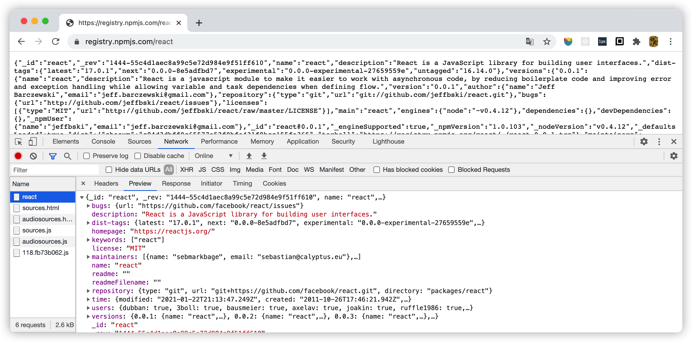

# npm 深入了解

## 前言

据了解，大多数前端开发人员对 npm 的使用就只是为了让项目跑起来，很少人有正经的学一下 npm 到底是什么。其实我也一样，所以我就趁春节期间，好好学一学 npm。本文是我通过学习官方文档，结合之前所学，再加上源码的阅读，综合下来所写的我对 npm 的理解。本文所写的是我认为有必要了解的，还有一些没必要了解的就没有写出来。对于一些篇幅过长的内容拆到其他文章写。

npm 由三个独立的部分组成：网站、注册表、命令行工具

- 网站：提供可视化视图界面，用于资料查阅
- 注册表：为整个社区生态提供数据支撑
- 命令行工具：为项目开发提供了一系列资源管理的工具

命令行工具又包含很多内容：

- 命令行工具提供了大量的配置参数，要学会如何修改配置
- 命令行工具要在项目中使用，需要 package.json 文件，需要知道 package.json 有哪些内容
- 在项目中安装模块，会引发很多，需要知道安装过程中经历了什么，模块间存放位置如何组织的，为什么需要 package-lock.json 文件
- 开发模块和安装模块都需要关注版本号，需要知道版本号该如何书写

以上提到的内容都是本文需要讲解的知识点，下面开启正文。

## npm 网站


用来查找对应的模块的信息，可以进 [网站](https://www.npmjs.com/) 搜索，如果知道模块名称，可以直接拼上链接，规则是：

`https://www.npmjs.com/package/` + 模块名

例如 `react` 模块就是：`https://www.npmjs.com/package/react`

默认显示的是最新版本，如果想要指定其他版本，可以在后面加上

- `/v/` + 版本号，例如：`https://www.npmjs.com/package/react/v/16.8.6`
- `/v/` + 标签名，例如：`https://www.npmjs.com/package/react/v/latest`

> 如果是淘宝镜像地址，格式是如下：
>
> `https://developer.aliyun.com/mirror/npm/package/` + 模块名
>
> 指定版本地址同理
>
> **注意：淘宝里的信息不一定是最新的，每 10 分钟自动同步一次。如果发现不是最新的，可以手动点下 `SYNC`**
>
> 

> 另外除了 npm 有淘宝镜像地址，github 也同样有，只要在域名后面加上 `.cnpmjs.org` 即可。例如 `https://github.com/facebook/react` 改成 `https://github.com.cnpmjs.org/facebook/react`

## npm 注册表

注册表是一个巨大的数据库，保存了每个模块的信息。

注册表也可以看作一系列接口，用来获取每一个模块的信息，接口访问格式是：

`https://registry.npmjs.com/` + 模块名

比如 react 模块信息，可以访问 `https://registry.npmjs.com/react`，就可能拿到该模块所有信息数据。



从这些数据里看找到模块的下载地址，在指定版本下的 `dist -> tarball`


模块下载路径有一个通用的格式，我们是可以直接得出下载地址的，格式如下：

`https://registry.npmjs.com/[module]/-/[module]-[version].tgz`

其中 `[module]` 是模块名称，`[version]` 是模块版本，例如：

`https://registry.npmjs.org/react/-/react-16.8.6.tgz`

> 如果是淘宝镜像，格式是如下：
> 
> `https://registry.npm.taobao.org/` + 模块名
> 
> `https://registry.npm.taobao.org/[module]/download/[module]-[version].tgz`

对于一些二进制模块，例如 `node`、`node-sass` 等，针对于这类模块，淘宝镜像提供了另一个下载地址，格式如下：

`https://npm.taobao.org/mirrors/` + 模块名

进入后就能根据版本号找到对应的下载包。


不过这边并不是所有模块都有，如果没内容就是没有。

## 命令行工具

命令行工具又称为 CI，通过命令行或终端运行，从而触发某些文件的执行。

命令行工具分为两部分：内置命令行、npm scripts

### 内置命令行

> 官方文档：https://docs.npmjs.com/cli/v6/commands/

这块建议查官方文档，这边就只是做了分类整理，放在另外一篇文档里，请移至 [《npm 内置命令行整理》](./NpmCommand.md) 

### npm scripts

> 官方文档：https://docs.npmjs.com/cli/v6/using-npm/scripts

#### 什么是 npm scripts？

npm scripts 指的是 package.json 文件里配置的 `scripts`，例如：

```json
{
    "scripts": {
        "start": "webpack-dev-server --mode=development --open",
        "build": "webpack --mode=production",
        "lint": "eslint --ext js,vue src"
    }
}
```

这边 `scripts` 下定义了 `start`、`build`、`lint` 三个属性，对应三条命令行语句，这就相当于定义了三条命令行，这三条命令行就属于 npm scripts。

npm scripts 的出现为开发者提供了自定义命令行的途径，将一些常用的命令行封装起来，并取一个更具业务或功能含义的名字。

定义好命令行后通过以下命令行来执行：

```sh
$ npm run <command>
# 或者
$ npm run-script <command>
```
这边的 `<command>` 传入命令行名称，例如执行 `lint` ：

```sh
$ npm run lint
```

#### 其他相关命令行

对于一些常用的命令，npm 提供了一些简写写法，可以省去 `run` ：

- `npm run start` -> `npm start`
- `npm run build` -> `npm build`
- `npm run stop` -> `npm stop`
- `npm run test` -> `npm test`

`npm run` 是针对于当前项目的 package.json 文件，如果想运行 node_modules 里某个模块的 npm scripts，就需要借助另外一个命令：

```sh
$ npm explore <module> -- npm run <command>
```

#### 生命周期

npm scripts 每一条命令行都有对应的生命周期，例如 scripts 这样定义：

```json
{
    "scripts": {
        "prestart": "",
        "start": "",
        "poststart": ""
    }
}
```

这时候执行 `npm run start` 会经历这样的过程：

1. `npm run prestart`
2. `npm run start`
3. `npm run poststart`

执行 `start` 之前会先执行 `prestart`，执行 `start` 之后还会执行 `poststart` 。每条命令行都遵守这样的执行规则，都有 `pre` 和 `post`。`prestart` 自身也有生命周期，也有自己的 `preprestart` 和 `postprestart`。不过只会执行当前命令行的 `prev` 和 `post` ，不会触发 `prev` 和 `post` 自身的生命周期。只有当你手动执行 `prestart` 时，才会触发 `preprestart` 的执行。

如果 npm script 没有定义 `prestart` 和 `poststart` ，就不做任何操作。

除了 `pre` 和 `post` ，npm scripts 还内置了几个特殊的生命周期钩子。

- `prepare`
    - 执行 `npm pack` 之前
    - 执行 `npm publish` 之前
    - 执行 `npm install` 之前
    - 触发 `prepublishOnly` 之前，`prepublish` 之后
- `prepublish` 已废弃，请使用 `prepare`
- `prepublishOnly`
    - 执行 `npm publish` 之前
- `postpublish`
    - 执行 `npm publish` 之后
- `prepack`
    - 执行 `npm pack` 之前
    - 执行 `npm publish` 之前
- `postpack`
    - 执行 `npm pack` 之后

> 执行 `npm run pack` 与执行 `npm pack` 不同，前者是执行 npm scripts 定义的命令，后者是执行 npm 内置命令

以上的生命周期是执行内置命令行时触发的 npm scripts。通常内置命令行不会触发 npm scripts，只有个别特殊的命令才会，下列是这些特殊命令行触发的生命周期执行顺序：

- `npm publish`
    - `prepublish`
    - `prepare`
    - `prepublishOnly`
    - `prepack`
    - `postpack`
    - `publish`
    - `postpublish`
- `npm pack`
    - `prepublish`
    - `prepare`
    - `prepack`
    - `postpack`
- `npm install`
    - `preinstall`
    - `install`
    - `postinstall`
    - `prepublish`
    - `prepare`
    - `preshrinkwrap`
    - `shrinkwrap`
    - `postshrinkwrap`
- `npm restart`
    - `prerestart`
    - `prestop`
    - `stop`
    - `poststop`
    - `restart`
    - `prestart`
    - `start`
    - `poststart`
    - `postrestart`

以上是从项目的角度看，如果是作为模块，被项目安装，例如执行 `npm install react`。身为模块的 `react` 被安装，会先触发模块自身的生命周期，先卸载后安装：

- `preuninstall`
- `uninstall`
- `postuninstall`
- `preinstall`
- `install`
- `postinstall`

#### 运行环境

npm scripts 与终端所处的运行环境有所不同，例如：

```json
{
    "scripts": {
        "start": "webpack-dev-server --mode=development --open"
    }
}
```

```sh
$ npm run start
```

在 npm scripts 上定义后，再用 `npm run` 去执行，跟直接在终端执行：

```sh
$ webpack-dev-server --mode=development --open
```

这两者是有区别的。在 npm scripts 能执行，在终端并不一定能执行，因为这两者所处的环境不同，接下来来分析下为什么不同。

执行这样一条命令行，其实是去查找名为 `webpack-dev-server` 的可执行文件并执行它。查找的方式就是去查找环境变量 PATH，环境变量 PATH 上记录着一个个目录，从这一个个目录里找到对应的可执行文件。

不同系统的可执行文件类型不一样。通常在 Window 系统里是查找 cmd 文件，在 Linux 或 Mac 系统里是查找软链接或者直接使用 JS 文件。

不同系统查找环境变量 PATH 的方式也不一样：

- Window 系统的 cmd 程序或者 npm scripts 里是执行 `set PATH`
- Window 系统的 PowerShell 里是执行 `$env:PATH`
- Linux 和 Mac 系统是执行 `echo $PATH`

Window 返回的是这样一串字符串，存储着一个个目录地址，目录之间用分号隔开

```
C:\Program Files\PowerShell\7;C:\Program Files\Microsoft VS Code\bin;C:\Program Files\Common Files\Autodesk Shared\;D:\apache-maven-3.2.5\bin;C:\Program Files\Java\jdk1.8.0_181\bin;C:\Program Files\TortoiseSVN\bin;C:\Python27;C:\Program Files\nodejs\;C:\Program Files (x86)\Yarn\bin\;C:\Program Files\Microsoft VS Code\bin;C:\Users\jencia\AppData\Roaming\npm;C:\Users\jencia\AppData\Local\Yarn\bin
```

Linux 和 Mac 系统返回的也是一串字符串存储着一个个目录地址，不一样的是目录之间是用冒号隔开的

```
/usr/local/bin:/usr/bin:/bin:/usr/sbin:/sbin
```

以上是在终端上输出的结果。如果是在 npm scripts 执行，结果就不一样了，比如 npm scripts 这样定义：

```json
{
    "scripts": {
        "env": "echo $PATH"
    }
}
```

假设这是在 Mac 系统环境，执行 `npm run env` 的结果会变成这样：

```
/usr/local/lib/node_modules/npm/node_modules/npm-lifecycle/node-gyp-bin:/Users/jencia/Workspace/test/node_modules/.bin:/usr/local/bin:/usr/bin:/bin:/usr/sbin:/sbin
```

多了两个目录（Window 系统也是）：

- `/usr/local/lib/node_modules/npm/node_modules/npm-lifecycle/node-gyp-bin`
- `/Users/jencia/Workspace/test/node_modules/.bin`

npm scripts 内部构建了一个局部环境变量，局部环境变量的 PATH 的前面加入这两个目录。 执行 npm scripts 的命令行时都处在这个局部环境变量下。这两个目录里存的东西就是 npm scripts 和终端执行时运行环境的差异。

第一个目录地址是全局 npm 安装目录下 `npm-lifecycle` 模块里的其中一个目录。这目录下只有两个文件：`node-gyp` 和 `node-gyp.cmd`。cmd 后缀的是 window 里使用，没有后缀名的是 Linux 和 Mac 里使用的，其实就是一个文件。也就是说加入这个目录，就是为了使用 `node-gyp` 命令。这里不深究 `node-gyp` 的作用，这边需要用到这个命令是因为当你执行 `npm install` 的时候内部会去执行 `node-gyp rebuild`。

第二个目录是当前项目下的 `./node_modules/.bin` 目录，每个项目的 `node_modules` 下都会有一个 `.bin` 目录，里面存放的一些可执行文件，这些可执行文件是可以在 npm scripts 里直接以命令行的方式使用的。至于这些可执行文件如何产生的，在安装模块时，有些模块是命令行模块，安装完后就会在 `./node_modules/.bin` 目录里生成对应的可执行文件。以这种方式管理命令行工具，而不是直接使用全局命令行，是为了保证项目团队每个人都是用同一个版本的命令，避免出现不一样的执行结果。


#### 环境变量

上一节讲了 npm scripts 会有一个局部环境变量，除了 PATH 不一样，还存放着一些其他的 npm 相关的环境变量，用于在 NodeJS 代码里读取使用。读取的方式如下：

```json
{
    "scripts": {
        "start": "node index.js"
    }
}
```

```sh
$ npm run start
```

```js
// index.js
console.log(process.env);
```

这边通过 npm scripts 使用 node 去运行 `index.js` 文件，这时候将打印出了所有环境变量。

在终端直接运行 `node index.js` 也可以打印出来，只是缺少 npm 相关环境变量。

这个局部环境变量主要加入了三块数据：包数据、配置数据、生命周期数据。

**1. 包数据**
package.json 文件里的所有内容，都会转化为数据，例如：

```json
{
    "name": "my-project",
    "keywords": ["111", "222", "333"],
    "config": {
        "test": "aaaaa"
    },
    "scripts": {
        "start": "node index.js",
    },
    "devDependencies": {
        "webpack-cli": "^4.5.0"
    }
}
```

转化后的数据：

```js
{
    npm_package_name: 'my-project',
    npm_package_keywords_0: '111',
    npm_package_keywords_1: '222',
    npm_package_keywords_2: '333',
    npm_package_config_test: 'aaaaa'
    npm_package_scripts_start: 'node index.js',
    npm_package_devDependencies_webpack_cli: '^4.5.0',
}
```

全部以 `npm_package_` 开头，转成扁平化数据，单词之间用下划线连接，中划线都被转为下划线。

**2. 配置数据**

npm 的配置有很多种方式，下一章节的 [配置参数](配置参数) 将详细讲解，这边就以 `.npmrc` 为例讲解。

假设 .npmrc 是这样：

```
aaa=111
bbb=222
```

转化后的数据：

```js
{
    npm_config_aaa: '111',
    npm_config_bbb: '222'
}
```

全部以 `npm_config_` 开头，拼上配置项名称，值都为字符串。这边只举例两条配置项，实际会有很多，包括全局配置、命令行参数配置。

**3. 生命周期数据**

这块只有两条数据：

- `npm_lifecycle_event` 当前触发事件的名称
- `npm_lifecycle_script` 当前触发事件对应的命令行

## 配置参数

配置参数的作用主要有这几方面：

- npm 内部使用了配置参数，添加配置可修改默认参数，比如切换镜像源
- 部分第三方模块也配置参数，可用于定制化配置，比如 `node-sass` 更换二进制文件下载地址
- 团队开发使用同一套配置参数可以统一开发环境

添加配置参数有好几种方式，下列按照优先级由高到低讲解：

### 命令行添加参数

```json
{
    "scripts": {
        "start": "node index.js"
    }
}
```

```sh
$ npm run start --test1='hello world' --test-2
```

```js
// index.js
console.log(process.env.npm_config_test1) // 'hello world'
console.log(process.env.npm_config_test_2) // true
```

以上就是在命令行加参数的例子，其中有几个需要注意的地方：

- 加参数是在执行 `npm run` 的时候加，而不是在 npm scripts 上面加
- 以 `--` 代表一个参数，后面紧跟上参数名
- 参数值不写代表 `'true'`，如果有参数值，必须加上等号（官网文档写错了），等号前后不能有空格
- 获取数据时都要在参数名前面加上 `npm_config_`，如果参数名有横杆，会被转为下划线


### 设置环境变量

环境变量里以 `npm_config_` 或 `NPM_CONFIG_` 开头的都会认为是配置参数，不管大小写都会统一转成小写，横杆转为下划线。如何设置环境变量不讲了，就像系统的那个环境变量，网上自己查，只要名字满足要求就好。

### 项目根目录创建 `.npmrc` 文件

```
aaa='111'
bbb=222
ccc
```

```js
console.log(process.env.npm_config_aaa);    // '111'
console.log(process.env.npm_config_bbb);    // '222'
console.log(process.env.npm_config_ccc);    // 'true'
```

### 修改用户目录 `.npmrc` 文件

Window 系统在 `c:\Users\用户名\.npmrc`，Linux 和 Mac 系统在 `~/.npmrc`

也可以通过命令行管理：

```sh
# 设置配置
$ npm config set aaa '111'
# 查看配置
$ npm config get aaa
# 删除配置
$ npm config delete aaa
```

这命令修改的就是用户目录的 `.npmrc` 文件。

### 修改全局配置文件

文件位置在 `$PREFIX/etc/npmrc`，其中 `$PREFIX` 可以通过命令行查看：

```sh
$ npm config get prefix
```

Window 系统一般找不到这个路径，需要自己修改 `globalconfig` 参数设置全局配置文件的位置。`globalconfig` 本身就是一个配置参数，按照上述那几种方式选一种设置就好了。

npm 本身提供了很多默认配置，各个配置的作用和默认值，建议查阅官方文档 [ Config Settings](https://docs.npmjs.com/cli/v6/using-npm/config#config-settings) 章节。

## 版本管理

> npm 内部使用的版本管理是引用 [semver]((https://github.com/npm/node-semver)) 模块

npm 的版本遵守统一的规则：

```
<major>.<minor>.<patch>
<major>.<minor>.<patch>-<prerelease>
<major>.<minor>.<patch>-<alpha|beta|rc>.<prerelease>

例如：
1.5.2
1.5.3-2
1.5.3-alpha.5
```

- `major` 主版本号，破坏性改动，与旧版本不兼容
- `minor` 次版本号，新功能改动，能兼容旧版本
- `patch` 修订版本号，问题修复和优化，能兼容旧版本
- `alpha` 内测版本，给内部人员测试使用的版本，问题可能很多，可能会频繁变动
- `beta` 公测版本，开放给公众人员使用，但仍然可能出现很多问题
- `rc` 预览版本，比 `beta` 更稳定，功能不会再增加
- `prerelease` 预发布版本号

版本必须包含 `major`、`minor`、`patch` 三部分，第一个版本号从 `1.0.0` 开始。

`alpha`、`beta`、`rc` 可选，属于预发布标识。`prerelease` 通常是有预发布标识才需要加上。

以上是版本的书写规则，至于版本管理，分为两方面：项目版本管理和模块依赖版本

### 项目版本管理

这边的项目版本指的是 package.json 文件的 `version` 属性：

```jsonc
{
    "name": "module-name",
    "version": "1.0.0",
    "author": "jencia",
    // ...
}
```

一般只有在开发模块的时候才需要关心版本号，发布模块的时候就是以这个版本号进行发布。这边版本号可以手动修改，但不建议这样做，建议用命令行 `npm version` 升级版本。

语法：

```
npm version [<newversion> | major | minor | patch | premajor | preminor | prepatch | prerelease [--preid=<prerelease-id>] | from-git]
```

常用的就这几种：

- 升级主版本号

```sh
$ npm version major
```

- 升级次版本号

```sh
$ npm version minor
```

- 升级修订版本号

```sh
$ npm version patch
```

- 标记为预发布版本并升级

```sh
$ npm version prerelease --preid=alpha
```

如果项目结构组织是采用 [monorepos](https://github.com/babel/babel/blob/master/doc/design/monorepo.md) 就不适合这种方式，建议使用 [Lerna](https://lerna.js.org/) 管理

### 模块依赖版本

项目开发中通常会使用第三方模块，也就会依赖其他模块，依赖的模块都会记录在 package.json 的 `dependencies` 或 `devDependencies` ，例如：

```json
{
    "dependencies": {
        "axios": "^0.21.0",
        "core-js": "^3.6.5",
        "dayjs": "^1.9.7",
        "element-ui": "^2.14.1",
        "qs": "^6.9.4",
        "store": "^2.0.12",
        "vue": "^2.6.11",
        "vue-class-component": "^7.2.3",
        "vue-property-decorator": "^8.4.2",
        "vue-router": "^3.2.0",
        "vuex": "^3.4.0",
        "wangeditor": "^4.6.3"
    }
}
```

通常会以 `^x.x.x` 的方式写，版本号前面会加上 `^` ，这表示主版本号不升级，次版本号和修订版本号安装最新版本。当然写法不只这一种，下面将列出所有情况：

- 固定版本

    - `1.5.2` -> `1.5.2`
    - `=1.5.2` -> `1.5.2`
    - `v1.5.2` -> `1.5.2`

- 使用 `>`、`>=`、`<`、`<=` 范围版本

    - `>1.5.1` -> 大于 `1.5.1`
    - `>=1.5.1` -> 大于等于 `1.5.1`
    - `<1.5.1` -> 小于 `1.5.1`
    - `<=1.5.1` -> 小于等于 `1.5.1`
    - `>1.5.1 <1.7.0` -> 大于 `1.5.1` 小于 `1.7.0`
    - `1.5.1 || >1.7.0` -> 等于 `1.5.1` 或大于 `1.7.0`

- 使用 `-` 、`*` 、`x`

    - `1.2.3 - 2.3.4` -> `>=1.2.3 <=2.3.4`
    - `1.2 - 2.3.4` -> `>=1.2.0 <=2.3.4`
    - `1.2.3 - 2.3` -> `>=1.2.3 <2.4.0`
    - `1.2.3 - 2` -> `>=1.2.3 <3.0.0`
    - `*` -> `>=0.0.0`
    - `1.x` -> `>=1.0.0 <2.0.0`
    - `1.2.x` -> `>=1.2.0 <1.3.0`
    - `""`(空字符串) -> `*` -> `>=0.0.0`
    - `1` -> `1.x.x` -> `>=1.0.0 <2.0.0`
    - `1.2` -> `1.2.x` -> `>=1.2.0 <1.3.0`

- 使用 `^` 、`~`

    - `~1.2.3` -> `>=1.2.3 <1.3.0` -> 只升级修订版本号
    - `^1.2.3` -> `>=1.2.3 <2.0.0` -> 只升级次版本号和修订版本号

对于预发布版本有几个值得注意的点：

- `~1.2.3-beta.2` -> `>=1.2.3-beta.2 <1.3.0`
- `^1.2.3-beta.2` -> `>=1.2.3-beta.2 <2.0.0`

拿第一个来说，大于 `1.2.3-beta.2 <1.3.0` 的条件，`1.2.9` 能满足条件，但如果是 `1.2.9-beta.6` 就不能满足条件。对于带有预发布版本标识的只能是 `1.2.3` 下的，比如 `1.2.3-beta.8` 能满足。这个语句更加准确的描述应该是 `>=1.2.3-beta.3 <1.2.4 || >=1.2.4 <1.3.0`


未完待续...

