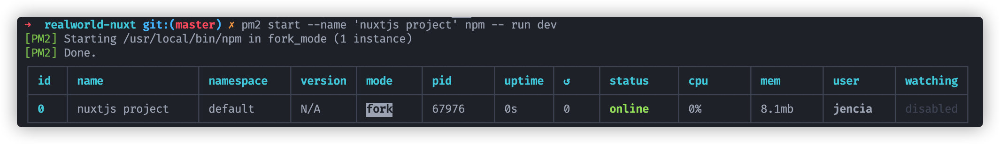

# PM2 使用教程

>  官方文档：https://pm2.keymetrics.io/
>
>  写此文档时的版本是 4.5.0 ，当前版本不适合 window 系统

## PM2 是什么

PM2 是一个守护进程管理器，它将帮助您管理应用程序并使其全天候在线。

要理解这句话，得先来看个例子。我们通常启动项目的话都是直接执行 `yarn run dev` 之类的命令，例如这边执行 `nuxtjs` 的开发环境命令：


这时候处于启动状态，终端就这样被占用着，我们无法继续往下使用，只能新建一个终端。而且如果窗口关掉了，应用就跟着关闭了。有时候一个应用要启动很久，这关掉了又得重新启动。

本地环境可以打开多个终端没问题，但在 Linux 服务器上开启多个将变得难以管理。如果应用启动完没有关闭就直接退出服务器，这时候就再也找不到之前启动的窗口了，只能执行 `kill` 强制关闭。

PM2 很好的解决了以上说的问题，使用 PM2 开启应用这样的：


会另起一个进程专门管理命令行程序，可以很方便的查看当前正在使用的应用。即使终端关闭了或退出服务器了，应用还依然存在，除非手动停止或删除了才会停下。

## 安装

```sh
$ npm install -g pm2
# or
$ yarn global add pm2
```

## 基本使用

### 创建应用

> 语法：`pm2 start [命令行或 node执行文件]`

创建应用分三种业务场景：

1. 运行 NodeJS 文件：

```sh
# 以前的方式
$ node server.js
# pm2的方式
$ pm2 start server.js
```

2. 启动全局命令行：

```sh
# 以前的方式
$ http-server
# pm2的方式
$ pm2 start http-server
```

3. 启动 Npm Scripts：

```sh
# 以前的方式
$ npm start
$ npm run dev

# pm2的方式
$ pm2 start npm -- start
$ pm2 start npm -- run dev

# 给应用重命名
$ pm2 start --name 'nuxtjs project' npm -- run dev
```

以下是最后一个条命令生成的结果：



**注意：都使用 npm 去启动应用的话会互相覆盖，即使传参不一样也会覆盖，最好每一个都重命名。**

### 查看应用打印日志

> 语法：`pm2 log [id或name]`

```sh
# 打印 id=0 的应用日志
$ pm2 log 0

# 打印所有日志
$ pm2 logs

# 打印最近 200 行日志
$ pm2 logs --lines 200
```


打印日志可以看到应用具体的启动状态，如果发现应用启动失败了，可以把日志打印出来看下报什么错，好排查问题。

### 查看当前应用列表

```sh
$ pm2 list
$ pm2 ls
$ pm2 l
$ pm2 ps
$ pm2 status
```

以上的写法效果都一样

### 停止应用

```sh
# 停止 id=0 的应用
$ pm2 stop 0
# 停止全部应用
$ pm2 stop all
```

### 重启应用

```sh
# 重载 id=0 的应用
$ pm2 reload 0
# 重载全部应用
$ pm2 reload all

# 重启 id=0 的应用
$ pm2 restart 0
# 重启所有应用
$ pm2 restart all
```

重启和重载的区别是：

- 对于单个应用操作没什么区别
- 对于多个应用操作，重载会逐个进行停止和启动，而重启是全部停止后再逐个启动

比较推荐用重载 ( `reload` )

### 删除应用

```sh
# 删除 id=0 的应用，两种写法一样
$ pm2 delete 0
$ pm2 del 0

# 删除全部
$ pm2 del all
```

## 进阶使用

### 开启监听模式

有时候我们希望文件修改后能够自动重启应用，这时候你可以通过添加 `--watch` 参数来开启监听模式，例如：

```sh
$ pm2 start app.js --watch
```

如果你是处于开发环境，通常会存在 `node_modules` 目录，这目录下文件较多，且很少改动，为了提高性能，通常需要指定忽略目录：

```sh
$ pm2 start app.js --watch --ignore-watch="node_modules"
```

### 运行模式切换

对于Node.js应用程序，PM2包括一个自动负载均衡器，它将在每个生成的进程之间共享所有HTTP[s]/Websocket/TCP/UDP连接。

如果想要在集群模式下启动应用可添加 `-i max` 参数，例如：

```sh
$ pm2 start app.js -i max
```

### 应用监控

应用监控有三种方式。

最简单的监控方式就是查看打印日志

```sh
$ pm2 logs
```

这命令可以一直开着，能够看到实时最新日志。

第二种是查看仪表盘：

```sh
$ pm2 monit
```


这种方式除了能看到打印日志外，还能看到应用使用率、内存占用量、CPU情况。

第三种是部署在 web 上更加完善的仪表盘：

```sh
$ pm2 plus
```

命令打下去会开启一个 Web 服务，登录后就能看到这样的界面：


## 使用配置文件

上述说的都是针对具体的命令行使用，在团队开发中，让每个人都去记住这些命令不太合适。不同项目可能启动项目的命令会有所不同，就算启动命令是相同的，如果多个项目同时开启，每次都要指定应用名称，就显得很麻烦。

解决以上问题最佳的方式是给每个项目都写 PM2 的配置文件。

### 配置

项目根目录下创建 `pm2.config.json` 文件（一定得是 JSON 文件）：

```json
{
  "apps": [
    {
      "name": "realworld-nuxt",
      "script": "npm",
      "args": "run dev"
    }
  ]
}
```

- `name` 应用名称
- `script` 启动程序
  - 用 NodeJS 访问文件来启动的话，就填写文件的相对路径
  - 全局命令就直接填写命令名称
  - Npm Scripts 命令写 `npm`
- `args` 命令行参数，没有就删掉这属性 
- `watch` 是否启动监听模式，传布尔值
- `ignore_watch` 监听忽略目录

更多参数说明查看 [这里](https://pm2.keymetrics.io/docs/usage/application-declaration/)

`apps` 可传对象，可传数组，数组下有几个对象就是几个应用命令。

### 使用

```sh
# 启动配置文件里的所有应用
$ pm2 start pm2.config.json
# 启动指定应用
$ pm2 start pm2.config.json --only realworld-nuxt

# 停止应用
$ pm2 stop pm2.config.json

# 重启应用
$ pm2 stop pm2.config.json

# 删除应用
$ pm2 stop pm2.config.json
```

每个项目都可以使用同一个命令，避免了记命令行的烦扰，也不需要再手动指定应用名称。

