# 从零带你搭建自动化部署

## 前言

最近双十一买了个服务器，打算这段时间折腾下服务器。之前了解了下自动化部署的东西，这次打算深入学习下自动化部署。既然是学习，就免不了记笔记，笔记内容又太简陋，所以就干脆把这过程记录下来，形成一篇文章。以下的内容是我搭建自动化部署的全过程，和过程中的一些思考。前端发展迅速，不同版本做法可能不一样，本文章编写时间 2020年11月14日。

所谓的自动化部署，就是当你执行 `git push` 提交代码后，服务器会自动拉取代码、安装依赖、构建打包生产环境代码、将待部署文件拷贝到服务器指定位置、安装依赖并运行代码（SPA项目忽略）。这一个过程其实并不难，最主要的是 “自动” 和 “部署” ，“自动” 就意味着你需要学习 GitHub Action 或 Jenkins。“部署” 就需要一台服务器，还需要懂 Linux 和 nginx。下面将一步步带你学习自动化部署的搭建。

## 云服务器

想要完成部署最好是要有自己的一台云服务器，没有的话装个虚拟机也行。已经熟悉云服务器的可以跳过此章节。

### 购买云服务器

服务器可以到 [阿里云](https://www.aliyun.com)、[腾讯云](https://cloud.tencent.com) 等这种云平台上面买，我这边买的是腾讯云的，因为在腾讯云里是新用户有打折。大家可以根据自己情况买，阿里云的服务器可能会比较好一点。由于我买的是腾讯云的，所以以下以腾讯云为例讲解。

服务器的选择：

- 先去 [首页](https://cloud.tencent.com) 当前有没有优惠活动，如果没有走正常购买流程，进入服务器 [选购页面](https://buy.cloud.tencent.com/cvm?tab=lite) 
- 服务器类型：请选择云服务器，别去选择轻量应用服务器
- 地域：选择离你最近的，大陆地区需要备案（就只是上传照片填写资料），香港和新加坡不需要备案。大陆访问速度快，香港和新加坡没有翻墙烦扰，自己权衡利弊选择
- 机型： 配置越大越好，根据自己的经济情况选择，我买的是 1核2G、50G硬盘，个人使用够用了
- 系统：选择 Linux ，Ubuntu 和 CentOS 都行。CentOS 的学习资料会多一点，我是选择这个
- 带宽：越大，访问速度越快，根据自己的经济情况选择

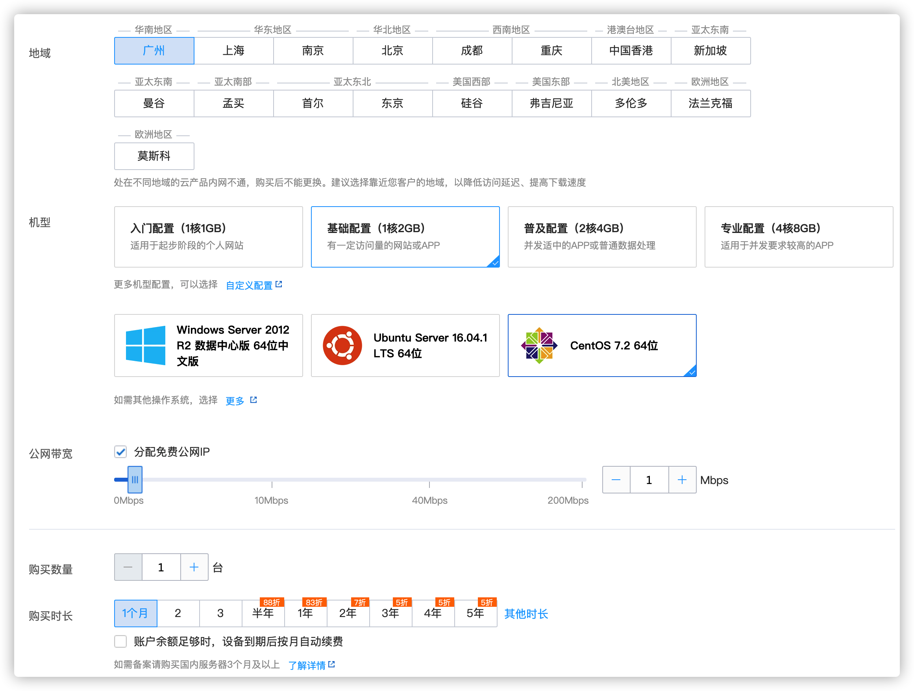

### 云服务器初始操作

#### 查看云服务器

服务器买完后就会可以到控制台里找到，进控制台，选择 `云产品 -> 云服务器`

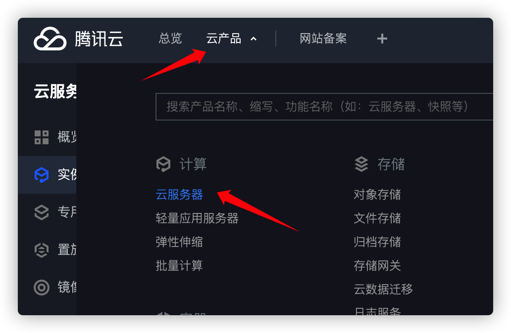

进来之后也许你看到的列表是空的，就像这样：

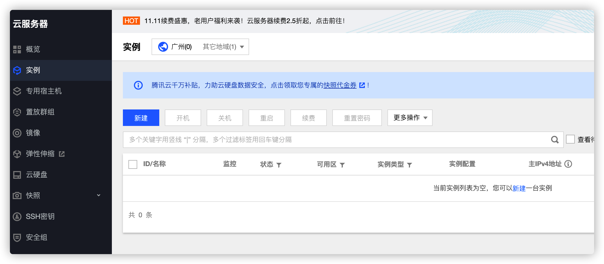

这可能是你所选的地区不对，看上面实例旁边的下拉框，这时候实例是广州，也许你买的是其他地区，切换一下：

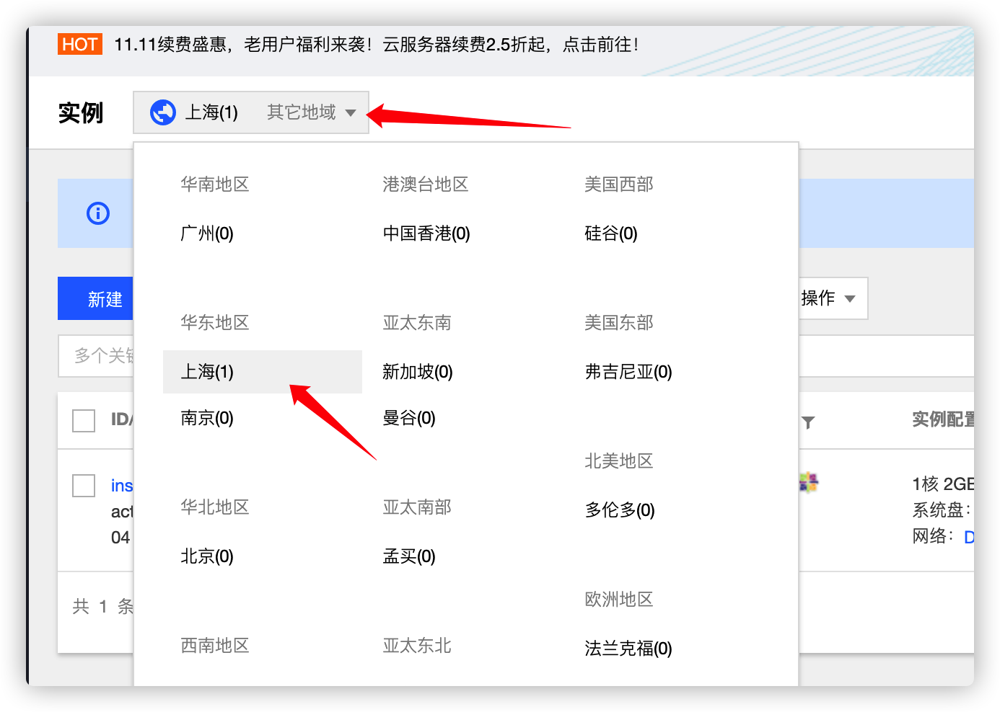

我这边买的是上海，所以选择上海，你要选择的是你买的服务器地区。这时候就能看到你的服务器信息

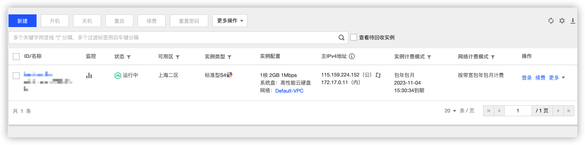

#### 公网 IP 是什么

每台服务器都会分配一个公网 IP 和内网 IP，公网 IP 就是可以让别人访问到的。比如我这台服务器，你可以在浏览器地址栏上输入 `115.159.224.152` 就能访问到我的服务器了。

我们正常访问百度是输入 `baidu.com` ，这是用域名访问，域名最终会被解析成公网 IP ，百度的公网 IP 是 `220.181.38.148` 。也就是说我们也可以输入 `220.181.38.148` 访问到百度。

云服务器其实就是一台电脑，唯一的区别就是云服务器有公网 IP，买云服务器最主要的就是买公网 IP。

一般这种 IP 地址很难被记住，所以才有了域名的存在，通过域名解析，将域名转化为公网 IP。域名是另外买的，下一节将讲解域名的购买和解析。

#### 重置密码

如果服务器是通过快速配置购买的，买过来就需要做重置密码操作，实例的操作列那边有个 ”更多“，点击 `更多 -> 密码/密钥 -> 重置密码`

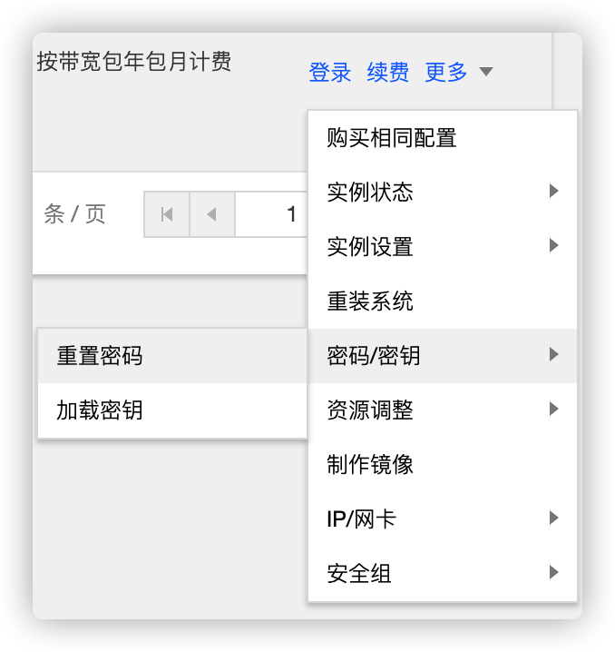

后面就按照引导操作。

### 域名购买

1. 进入 [域名注册页面](https://buy.cloud.tencent.com/domain) ，在哪个平台买的服务器就在哪个平台注册域名

2. 在搜索框里输入你喜欢的域名，点击查询，比如我的域名是 `jswalk`
   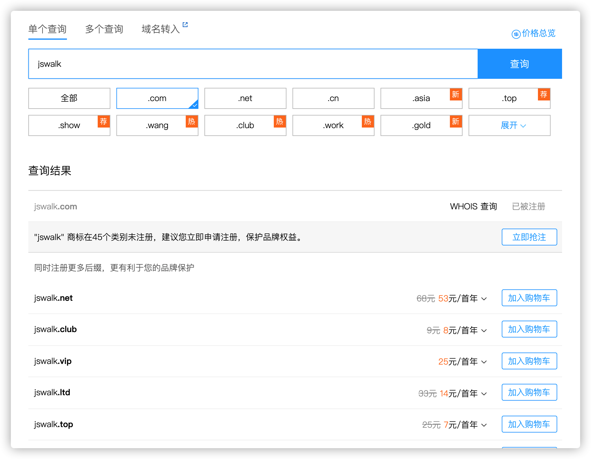

   `jswalk.com` 已经被我注册过了你就不能注册了，你可以换一个后缀名，或者换一个名字

3. 选完之后点击 “加入购物车”，在右侧购物车里点击立即购买，跳到提交订单页面

   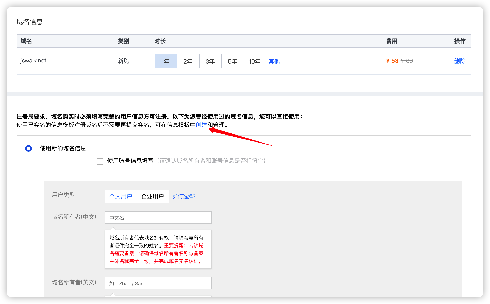

   这边需要填写域名信息，第一次购买的时候没有域名信息模板，需要点击创建，跳到模板管理界面

4. 到了域名信息模板界面后，点击 “新建模板” ，填写模板信息。填这些除了记录个人信息外，最主要的是进行实名认证。点击 “提交” 后会处于待审核状态。

5. 域名信息处于待审核状态，其实不影响后面的操作，不用管他，回到刚才的订单界面刷新一下。选择刚才填写的域名信息，勾选 “同意协议”，这时候就可以提交订单了。付款完就算购买成功了

### 域名解析

域名购买完后，在 [我的域名](https://console.cloud.tencent.com/domain) 就能看到你刚买的域名，这时候你会看到这样的界面：

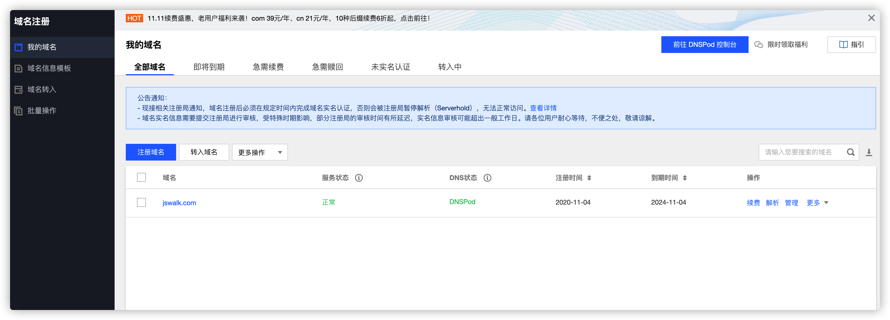

也许你的 “服务状态” 还处于审核状态，这可能会影响使用，不过不影响后面的操作。审核速度挺快的，一天之内就能完成。

点击 “解析” 会进入到 “域名解析列表” 页面

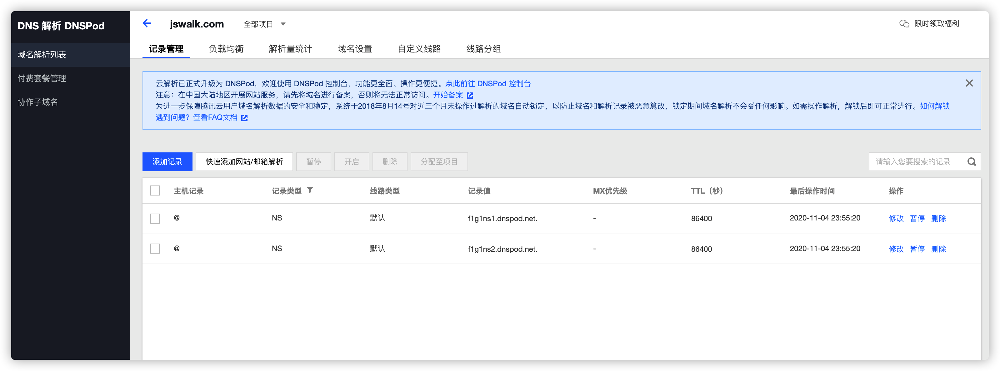

初始状态是两条记录，是默认生成的两条 DNS 解析配置。

域名解析就是将你的公网 IP 加入到解析记录里，网站解析属于比较常规的操作，可以点击这边的 “快速添加网站/邮箱解析”，选择 “网站解析” 立即设置

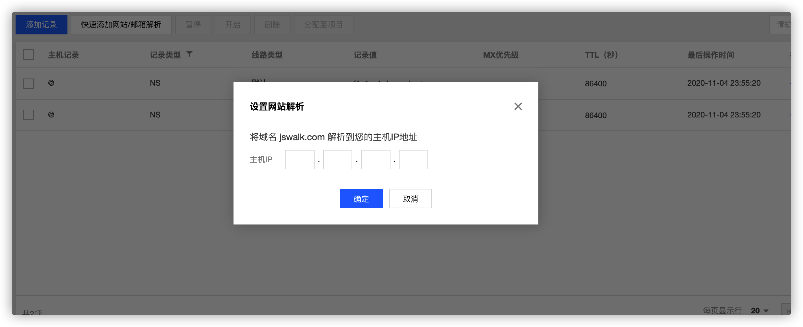

主机 IP 其实就是你服务器的公网 IP ，填上去点击确认，就会帮你生成两条记录，这域名解析的操作就算完成了。

如果你的服务器是大陆的服务器，需要对域名做备案才能正常使用。不过我一开始没备案还能正常使用，最好还是备案下，免得哪天突然不能用了。[备案地址](https://console.cloud.tencent.com/beian)

### 安全组配置

有的服务器刚买来默认只开通 80 端口，有的平台甚至连 80 端口都没开，需要自己去开通。

可能有些人不了解 80 端口是什么，这边解释一下，知道的人可以跳过。比如我们访问 `http://baidu.com`，其实访问的是 `http://baidu.com:80` ，地址后面的 `:80` 就是指定端口号为 80，不写的话默认就是 80。正常本地开发项目经常会使用 `localhost:3000` ，这个 3000 就是端口号。服务器刚买来的时候，这个端口是不开放的，你无法访问到这个端口号。

端口号的开通就是配置安全组，配置指定哪几个协议端口是属于安全的。安全组的入口你可以在云服务器界面下左侧菜单看到

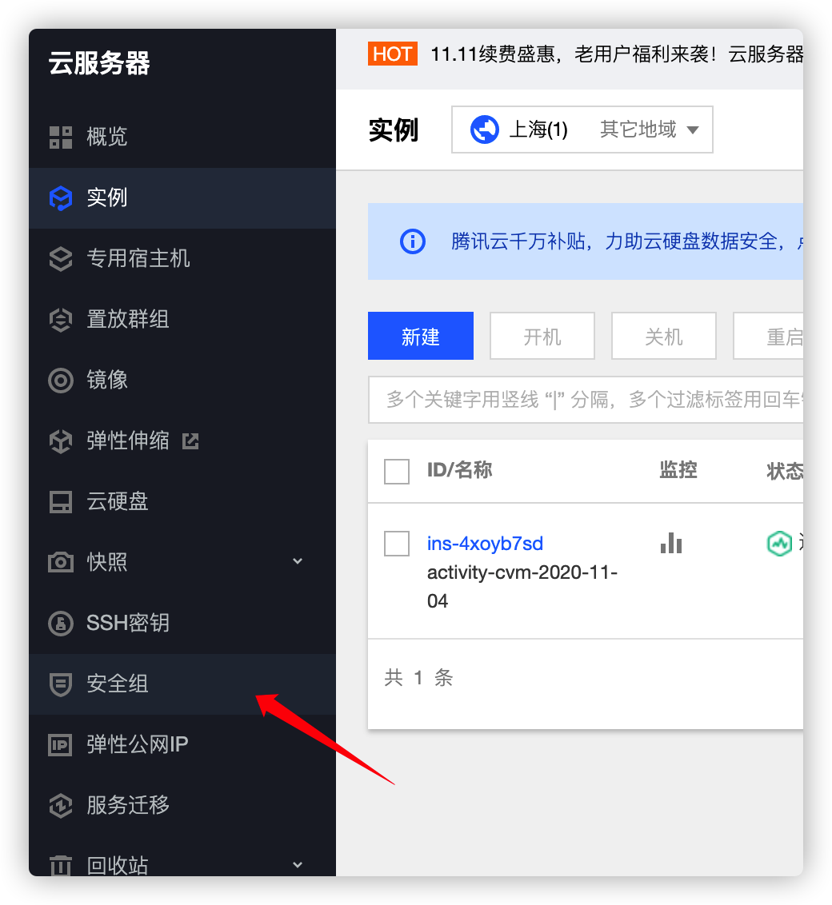

进去后可以看到会有一个默认的安全组，点击 “修改规则”，就到了 “安全组规则” 界面，接下来就是配这里的规则

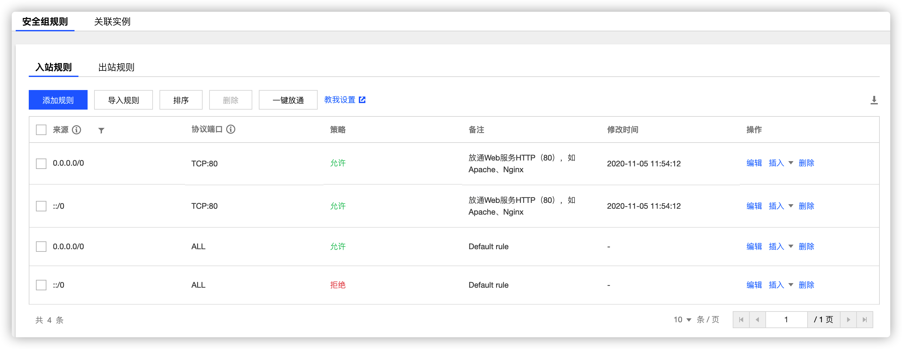

以上是我的服务器默认的配置，从配置来看默认开启所有端口

- `0.0.0.0/0` 表示允许所有 IP 访问服务器，协议类型为 IPv4 
- `::/0` 同上，只是这是 IPv6 类型的
- 协议端口写 `ALL` 就代表所有端口，策略还处于允许状态，代表这是所有端口都开放，一般选择拒绝会比较安全，要什么端口就自己开会比较合理。
- 默认还开了 `TCP:80` 端口，`TCP` 就代表 http、https 那些，`UDP` 就代表 WebSocket 那些

鼠标悬浮在感叹号图标上面可以看到详细信息，也可以点击 “教我设置” 可以看到详细的教程，我这边就以 8080 端口为例配置，点击 “添加规则”

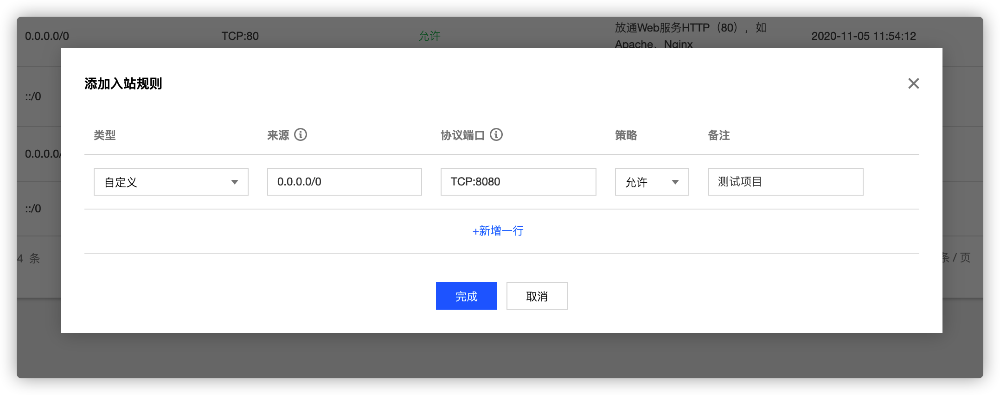

类型自定义，来源所有 IPv4 ，端口协议记得前面要写协议名，写完后点击 “完成” ，这整个过程就算完成了。

## 登录云服务器

登录之前确保安全组有开通 `TCP:22` 端口

登录服务器有两种方式：

- 远程登录
- SSH 登录 (推荐)

### 远程登录

进入控制台的云服务器管理页面，点击 “登录”，可能会需要微信确认下。

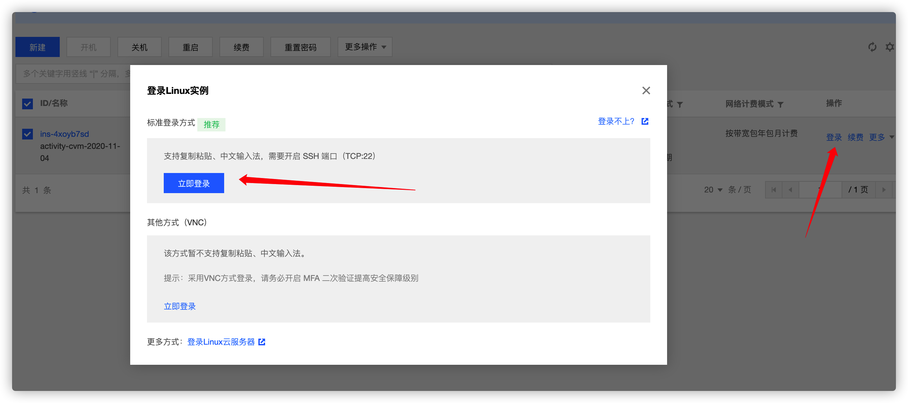

进去后输入账号密码信息就可以使用了

### SSH 登录

打开电脑上的终端（window 上是 `cmd` 或者 `powershell` ）

输入 `ssh [用户名]@[域名或公网IP]`，例如 `ssh root@jswalk.com`

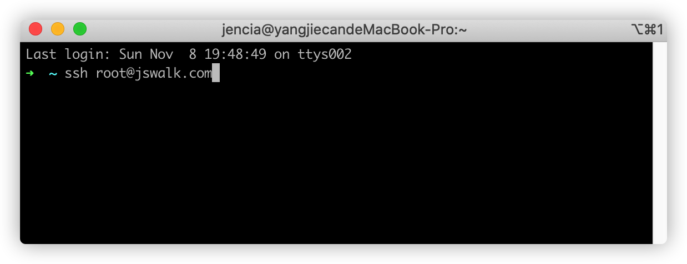

回车后就会提示需要输入密码，密码输完后就进去了。

### 免密登录

这不是第三种登录方式，而是让上面提到的两种登录方式不需要输入密码。以下是具体的操作：

1. 生成公钥和私钥

   ```sh
   $ keygen
   Generating public/private rsa key pair.
   # 问你文件名叫什么，文件名的写法比较推荐：域名_rsa
   Enter file in which to save the key (/Users/[用户名]/.ssh/id_rsa): jswalk_com_rsa
   # 输入口令，可以为空
   Enter passphrase (empty for no passphrase):
   Enter same passphrase again:
   ```

   这时候会在当前目录下生成两个文件： `jswalk_com_rsa` (私钥) 和 `jswalk_com_rsa.pub` (公钥)

2. 把公钥文件拷贝到服务器上

   使用 `scp` 命令将本地文件拷贝到服务器上，语法是：

   `scp [文件路径] [服务器用户名]@[域名或公网IP]:[服务器存放地址]`

   例如我这边的是这样的：

   ```sh
   $ scp ./jswalk_com_rsa.pub root@jswalk.com:/root/.ssh
   ```

   把刚才在当前位置生成的 `jswalk_com_rsa.pub` 文件拷贝到服务器上的 `/root/.ssh` 位置，一定要放在登录用户名目录下的 `.ssh` 目录

3. 私钥存在本地 `.ssh` 目录

   对于 `.ssh` 目录的位置，window 是在 `C:\Users\[用户名]\.ssh` ，Mac 是在 `/Users/[用户名]/.ssh`。把刚才生成的 `jswalk_com_rsa` 文件直接拷贝过去就好

4. 编写配置文件

   在 `.ssh` 目录下看下有没有 `config` 文件，有就直接编辑，没有就新建一个。文件内容如下：

   ```
   Host [你的域名或公网IP]
   HostName [你的域名或公网IP]
   User [用户名]
   PreferredAuthentications publickey
   IdentityFile /Users/[用户名]/.ssh/[你的私钥文件名称]
   ```

   中括号的内容改成你的信息就好了

5. 测试

   这时候使用 SSH 的方式登录，如果不需要输入密码就成功了。

## 搭建开发环境

> 我这边的系统是 CentOS 7.5

### 安装 NodeJS

#### 使用 `yum` 安装

`yum` 是 Linux 用来管理软件的命令，可以用它来装软件。

首先先确定下有没有 `yum` 命令：

```sh
$ yum --version
```

再确定下 NodeJS 的版本

```sh
$ yum list nodejs
```

如果版本太低的话（12.x 以下就算低），改下配置，执行命令：

```sh
curl --silent --location https://rpm.nodesource.com/setup_12.x | sudo bash -
```

这边将版本提到 `12.x` ，想要其他版本可以自己改数字，然后再看下版本对不对

```sh
$ yum list nodejs
```

版本不对的话我也不知道怎么弄，改用手动安装吧

版本对的话就能开始安装了：

```sh
$ yum install nodejs
```

安装完看下 NodeJS 版本是不是我们要的 `12.x`

```sh
$ node -v
```

如果找不到命令就重新连接下服务器，版本错了就代表这招行不通了，卸载掉：

```sh
$ yum remove nodejs
```

换成手动安装

#### 手动安装

到 [NodeJS 官网](http://nodejs.cn/download/) 下载安装包


你可以在这里选择当前最新版，也可以点击 “全部安装包” 的 “阿里云镜像” 里找到想要的版本号

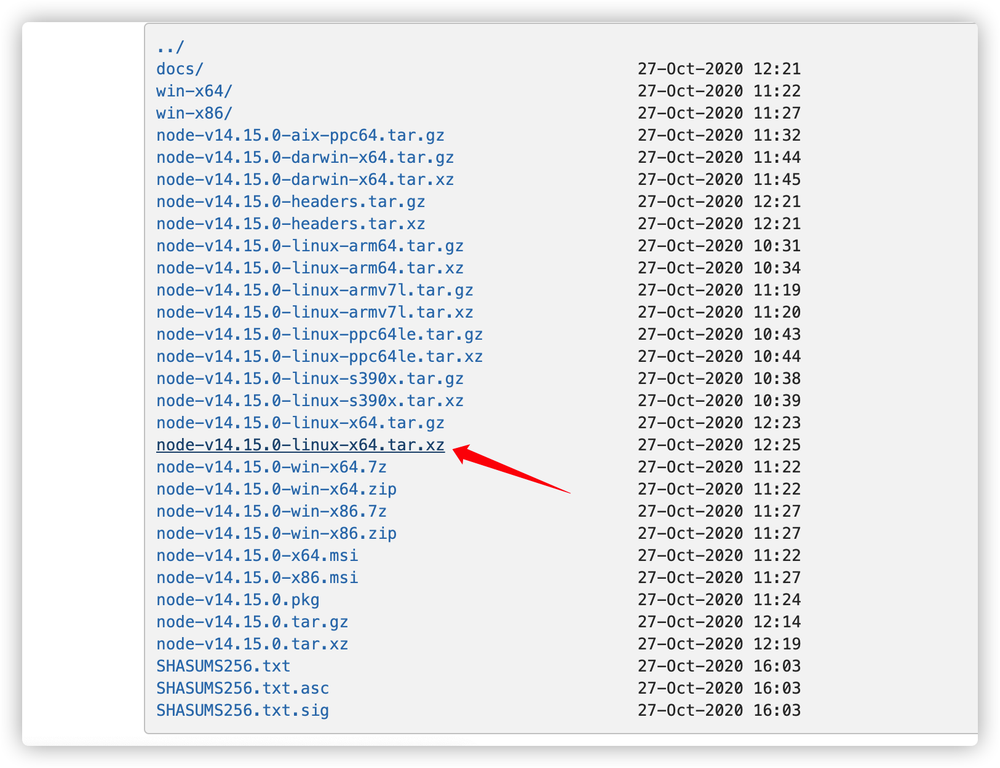

注意：这边不是点击下载，而是拷贝下载地址，比如这边是 `https://npm.taobao.org/mirrors/node/v14.15.0/node-v14.15.0-linux-x64.tar.xz`

然后进服务器，进入到你想要存安装包的位置，比如 `/root/workspaces/pkg` ，然后下载安装包

```sh
# 进入到存包的地方
$ cd /opt
# 下载安装包
$ wget https://npm.taobao.org/mirrors/node/v14.15.0/node-v14.15.0-linux-x64.tar.xz
# 解压
$ tar xf node-v14.15.0-linux-x64.tar.xz
# 移动包的位置
$ mv node-v14.15.0-linux-x64 /usr/local/nodejs
```

然后给 NodeJS 配置环境变量，配置环境变量的方式有很多种，这边推荐用软连接的方式，不要通过修改 `/etc/profile` 文件来配置，这种方式之后使用 Github actions 时无法识别到。

```sh
$ ln -s /usr/local/nodejs/bin/node /usr/local/bin/node
$ ln -s /usr/local/nodejs/bin/npm /usr/local/bin/npm
$ ln -s /usr/local/nodejs/bin/npx /usr/local/bin/npx
```

这时候就安装完成了，测试下：

```sh
$ node -v
v14.15.0
```

能成功打印出版本号就说明安装成功了。

### 安装 yarn

#### 使用 `yum` 安装

如果 NodeJS 不是使用 `yum` 安装的，请手动安装，不然会重复安装 NodeJS。

NodeJS 能安装成功说明 `yum` 环境没问题，这块的安装应该会很顺。

设置配置，将 `yarn` 加到 `yum` 里：

```sh
$ curl --silent --location https://dl.yarnpkg.com/rpm/yarn.repo | sudo tee /etc/yum.repos.d/yarn.repo
```

安装 `yarn`

```sh
$ yum install yarn
```

测试安装结果：

```sh
$ yarn --version
```

如果能成功输出版本号就说明安装成功了。

不行的服务器退出重新连接再试试，再不行就卸载掉换手动安装。

#### 手动安装

进入 [yarn 官网的安装页面](https://classic.yarnpkg.com/en/docs/install#centos-stable)

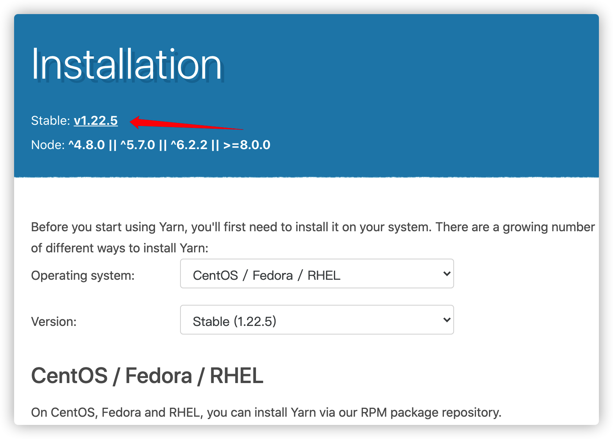

箭头标的是当前的稳定版本，进来这里也只是为了看稳定版本是多少。底下的内容是教你用 `yum` 安装，我们这边演示手动安装。记住这个版本后，然后去 Github 查找对应模块下的 [发布列表](https://github.com/yarnpkg/yarn/releases)

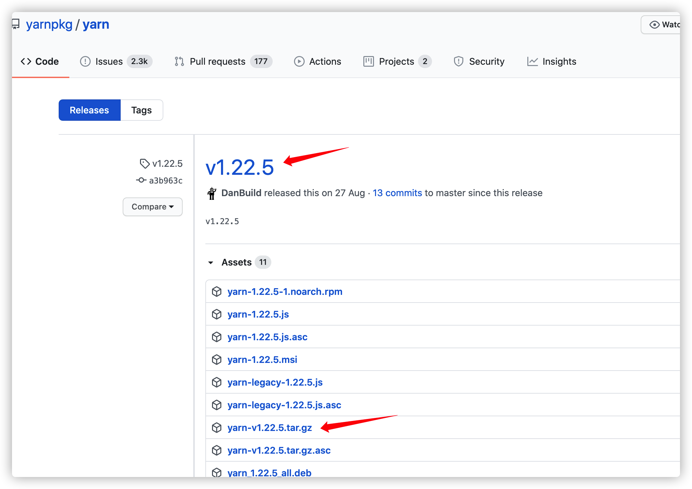

在 `yarn` 里的 `releases` ，找到稳定版本号 ( `v1.22.5` ) ，点击版本号后就能看到上面截图的界面。Linux 系统使用的选择 `.tar.gz` 后缀的文件，将访问链接拷贝过来，进入服务器执行命令行：

```sh
# 进入包的存放目录
$ cd /opt
# 将刚才拷贝的下载链接拷贝过来，前面加上 wget
$ wget https://github.com/yarnpkg/yarn/releases/download/v1.22.5/yarn-v1.22.5.tar.gz
# 解压
$ tar -zxvf yarn-v1.22.5.tar.gz
# 移动包的位置
$ mv yarn-v1.22.5 /usr/local/yarn
```

配置环境变量：

```sh
$ ln -s /usr/local/yarn/bin/yarn /usr/local/bin/yarn
$ yarn --version
```

如果成功输出版本号就说明安装成功了，继续下一步操作。

编辑 `/etc/profile` 文件：

```sh
$ vim /etc/profile
```

按 `i` 键开始编辑，在文件末尾的 `export Path=$Path` 语句后面（如果没有这个语句就自己加上）再加上 

```
:`yarn global bin`
```

按 `esc` 键退出编辑状态，输入 `:wq` 再回车，保存并退出，然后执行：

```sh
$ source /etc/profile
```

到这里就算安装完成了。

### 安装 PM2

关于什么是 PM2 ，可以看我另外一篇 [PM2 使用教程](./PM2.md)

```sh
$ yarn global add pm2
```

### 安装 ngnix

由于 `yum` 版本太旧，这边直接使用手动安装。

进 [nginx 官网](http://nginx.org/en/download.html) 找到文档版本

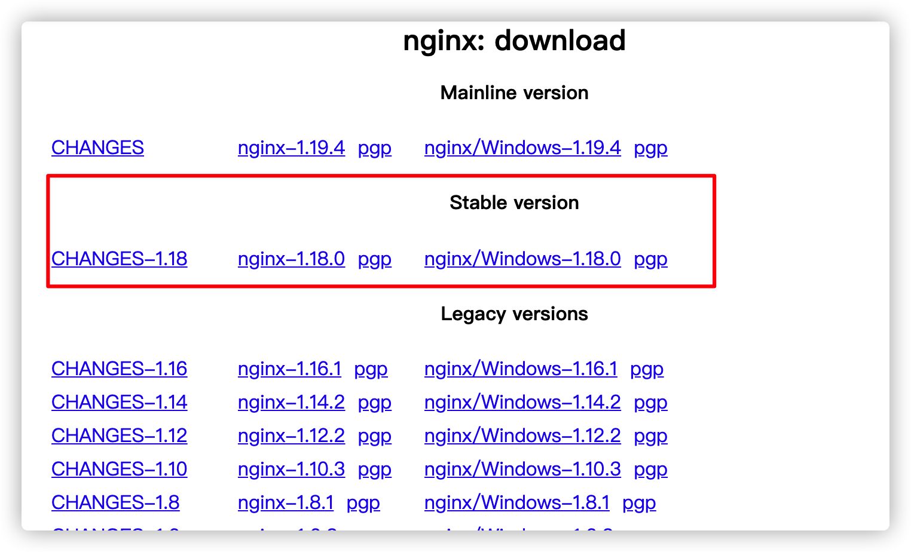

`Stable version` 翻译过来就是稳定版本，选中级那个，将地址拷贝下来。

```sh
# 安装 nginx 依赖
$ yum -y install gcc zlib zlib-devel pcre-devel openssl openssl-devel
# 进入安装包存放目录
$ cd /opt
# 下载，地址为刚才拷贝的地址
$ wget http://nginx.org/download/nginx-1.18.0.tar.gz
# 压缩
$ tar -xvf nginx-1.18.0

# 进入目录
$ cd nginx-1.18.0
# 安装
$ ./configure
$ make
$ make install
```

做完这些操作后，没有出现异常的话，就在 `/usr/local` 下找到 `nginx` 目录，就代表安装成功了。现在还剩最后一步，就是把 `nginx` 命令添加到环境变量，做法跟安装 NodeJS 一样：

```sh
$ vim /etc/profile
```

将 `:/usr/local/nginx/sbin` 添加到 `export PATH=$PATH` 的末尾，再保存退出，执行以下命令：

```sh
$ source /etc/profile
```

到这里 nginx 就安装完成了。

关于 nginx 的几个命令：

```sh
# 启动
$ nginx
# 重启
$ nginx -s reload
# 停止
$ nginx -s stop
# 退出
$ nginx -s quit
# 查看运行状态
$ ps -ef | grep nginx
```

到这里项目的基本环境就完成了，接下来就是开始部署项目。

## 服务器搭建

最终的目标是要完成自动化部署，自动化部署其实就是将一系列命令行集合起来执行，我们需要清楚每一块命令的作用，手动部署就将步骤拆开，自己逐个去操作，接下来就是演示怎么去部署一个项目。

### 项目分布规划

项目的种类有很多种，以后会有越来越多的项目部署上去，想要管理好这些项目就需要规划好哪种项目放哪个地方。

项目的种类大致分为两类：

- 纯前端项目
- 含有后端的项目

纯前端项目就是不需要开启 web 服务就可以直接访问的，通过访问 `html` 文件就能打开网页。客户端渲染的项目都是属于这一类，比如现在比较流行的 SPA 单页面应用项目。这种项目可以放在 nginx 的 `root` 下直接访问。

含有后端的项目，需要有自己的服务器。一般存放服务端渲染的项目（例如 NuxtJS 项目）这种前端代码和后端代码放在一个项目的。或者是存放作为接口服务的纯后端项目。这种项目无法在 `root` 下直接访问，需要在 nginx 做一层代理，每个项目都要配一个代理，所以这一类项目放一个目录方便管理。

根据上述分类，设计了以下目录结构：

```
├─ static-project/
│    ├─ proj1/
│    ├─ proj2/
│     ...
└─ node-project/
     ├─ proj3/
     ├─ proj4/
     ...
```

- `static-project` 对应 “纯前端项目”。纯前端项目其实就是一堆静态资源，可以直接在浏览器访问。
- `node-project` 对应 “含有后端的项目”。顾名思义，存放后端用 NodeJS 写的项目，直观的看出这里面有 NodeJS 代码，就是含有后端代码。如果你有 Java 项目，最好另外建一个 `java-project` ，毕竟不同语言环境不一样，最好分开放。
- `proj1` 、`proj2` 就是具体的项目，什么项目就写什么名称，这边什么名称，访问路径就是什么。

以上的分类只是为了管理项目对项目的存放位置做分类。随着项目越来越多，业务特征越来越明显，就会逐渐拆分业务线，因此还需要做下业务线分类。

我这边是个人网站，所以就以项目用处做分类，大致分为：

- 个人博客
- 示例项目
- 课程作业
- 个人组件库

我的服务器就自己使用，所以直接使用 `root` 用户，直接在 `root` 下创建项目，最终目录结构如下：

```
root/
├─ blog/
├─ demo/
├─ task/
└─ ui/
```

不同的业务线如果使用同一个域名，通常需要做二级域名。这边四种类别就对应四个二级域名，比如我的域名是 `jswalk.com` ，所有 `blog` 目录下的项目都挂载 `blog.jswalk.com` 域名下。

两种分类合在一起就是这样：

```
root/
├─ blog/
│   ├─ static-project/
│   │    ├─ proj1/
│   │    ├─ proj2/
│   │    ...
│   └─ node-project/
│        ├─ proj3/
│        ├─ proj4/
│        ...
├─ demo/
├─ task/
└─ ui/
```

`proj2` 的访问路径就是 `blog.jswalk.com/proj2` 。

至于一级域名是哪一个，如果一开始就确定的话，就建一个 `www` 目录作为一级域名目录。如果一开始不确定，后面才定的话，比如这时候我想让 `blog` 成为一级域名，不用改目录结构，在 nginx 上配个代理就行。

### 配置二级域名

根据我们的规划，需要使用到二级域名，而二级域名是需要解析才能使用的。二级域名的解析跟一级域名一样，进入域名解析页面（不知道怎么进的话参照上面讲的 [域名解析](#域名解析) ），在域名解析列表里配置二级域名。

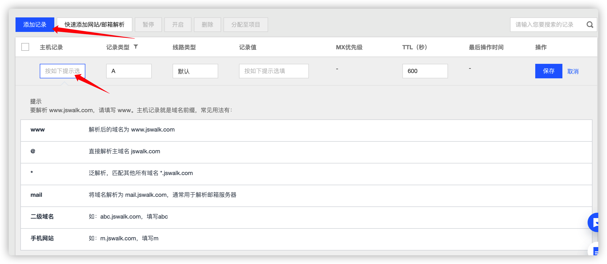

点击 “添加记录” 就会多出一行编辑状态的数据，图上显示的是初始状态，我们只需要填主机记录和记录值就好，其他使用默认值。

点击主机记录后，底下会出现提示信息教你怎么填，二级域名的话就直接填写二级域名的名称，比如我们需要域名是 `blog.jswalk.com` 那就填 `blog` 。

记录值填的是你云服务器的公网 IP，填完就点击 “保存” 就可以了。把四个二级域名都加上后列表数据应该是这样：


### 配置 nginx

上面准备工作做完，接下来就是开始搭建服务器了。这里以 nginx 为主服务器，nodejs 为辅服务器的方式搭建服务器。启动 nginx 服务器之前需要修改下配置。

为了方便后续修改 nginx 配置，在 `/root` 下创建一个指向 nginx 配置文件的软链接：

```sh
$ ln -s /usr/local/nginx/conf/nginx.conf nginx.conf
```

改配置前先复制一份作为备份：

```sh
$ cp nginx.conf nginx.conf.bak
```

> 注意这边虽然是复制软链接，其实是把真实文件复制出来，这时候的 `nginx.conf.bak` 是独立的一个文件。

编辑配置文件：

```sh
$ vim nginx.conf
```

> 这边编辑软链接，实际上编辑的是软链接对应的真实文件。

我们这边有四个二级域名，也就对应 4 个 `server` 配置，配置文件的基本结构应该是这样：

```nginx
http {
  server {}
  server {}
  server {}
  server {}
}
```

原来的配置不用删，需要做以调整：

1. 第一行的 `#user nobody;` 改成 `user root;` 。因为这边项目是放在 `root` 下，存在权限问题，需要指定启动 nginx 的账号为 `root` 账号才不会有权限问题
2. 把 `server` 部分删了，改成以下代码：

```nginx
http {
  server {
    listen 80;
    server_name blog.jswalk.com;

    location / {
      root /root/blog/static-project
    }
  }
  server {}
  server {}
  server {}
}
```

这边是先做了一些简单配置：

- `server_name` 设置二级域名地址
- `root` 设置服务器根目录

有四个二级域名，所以需要四个 `server` 。其他 `server` 配置一样，改一改 `server_name` 和 `root` 就好。

启动 nginx 服务器：

```sh
$ nginx
```

启动完后，`static-project` 里的项目就能直接访问了。

如果 `node-project` 下有项目的话，每一个项目都要单独配一个 `location` ，比如这里有一个 `realworld-nuxt` 项目，放在 `task` 目录下，那就应该这样配：

```nginx
http {
  ...
  server {
    listen 80;
    server_name task.jswalk.com;

    location / {
      root /root/task/static-project
    }
    location /realworld-nuxt {
      proxy_pass http://localhost:3000
    }
  }
}
```

`realworld-nuxt` 要单独启动 NodeJS 服务器，比如服务器端口是 3000 ，这边配置就是做个代理，将地址 `task.jswalk.com/realworld-nuxt` 转向 `localhost:3000` ，配置完记得重启 nginx 。

到这里一个最简单的服务器就算搭建完成了，后续再介绍更完善的配置和优化。

## 手动部署项目

自动化部署其实就是将手动部署的操作集合起来帮你去执行，所以手动部署其实就是将自动化部署的操作拆解开，自己一个个去操作，了解了这些操作才能知道怎么去修改配置、怎么排查错误。

这边以 Vue 项目和 NuxtJS 项目为例进行讲解，这两种项目分别对应着 “纯前端项目” 和 “含有后端的项目”，对应两种部署方式。

### Vue 项目部署

目标：以 `my-vue` 为项目名称发布到 `demo` 下的 `static-project` 里面。

首先配置基本路径，在根目录下创建 `vue.config.js` 文件：

```js
module.exports = {
    publicPath: '/my-vue'
}
```

后面就是一系列命令行操作：

```sh
# 构建生产环境包
$ yarn build

# 压缩文件，将 dist 目录压缩为 release.tgz 文件
$ tar -czvf release.tgz dist

# 将压缩包复制到服务器上
# 语法：scp <本地文件> <服务器用户名>@<域名或公网IP>:<服务器存放位置>
$ scp release.tgz root@jswalk.com:/root/demo/static-project

# 进入服务器
$ ssh root@jswalk.com
$ cd /root/demo/static-project

# 解压
$ tar -xzvf release.tgz
# 删除同名目录，重命名
$ rm -rf my-vue
$ mv dist my-vue
# 删除压缩包
$ rm -f release.tgz
```

总的来说就两个步骤：打包、上传服务器。

如果这时候 nginx 有启动，就可以直接访问到项目了，根据以上的步骤做下来，访问路径应该是 `http://demo.jswalk.com/my-vue/` ，看到页面就代表部署成功了。

### NuxtJS 项目部署

目标：以 `my-nuxtjs` 为项目名称发布到 `demo` 下的 `node-project` 里面。

首先修改配置，在根目录下创建 `nuxt.config.js` 文件：

```js
export default {
    // 配置基本路径
    router: {
        base: '/my-nuxt/'
    },
    // 配置 0.0.0.0 表示接受任何 IP 访问
    server: {
        host: '0.0.0.0',
        port: 3000
    }
}
```

然后创建 PM2 启动配置文件，在根目录下创建 `pm2.config.json` 文件：

```json
{
  "apps" : [
    {
      "name": "my-nuxtjs",
      "script": "npm",
      "args": "start"
    }
  ]
}
```

添加 nginx 配置：

```nginx
http {
  ...
  server {
    listen 80;
    server_name demo.jswalk.com;
    root /root/demo/static-project;
    
    ...
      
    location /my-nuxtjs {
      proxy_pass http://127.0.0.1:3000;
    }
  }
}
```

然后就是一系列命令行操作：

```sh
# 进入服务器
$ ssh root@jswalk.com
$ cd /root/demo/node-project

# 清理旧代码，创建项目目录
$ rm -rf my-nuxtjs
$ mkdir my-nuxtjs

# 回到客户端，进入项目目录
# 构建生产环境包
$ yarn build

# 压缩文件，将待部署文件和目录压缩为 release.tgz 文件
$ tar -czvf release.tgz .nuxt static nuxt.config.js package.json pm2.config.json yarn.lock

# 将压缩包复制到服务器上
# 语法：scp <本地文件> <服务器用户名>@<域名或公网IP>:<服务器存放位置>
$ scp release.tgz root@jswalk.com:/root/demo/node-project/my-nuxtjs

# 进入服务器，进入项目目录
$ ssh root@jswalk.com
$ cd /root/demo/node-project/my-nuxtjs

# 压缩
$ tar -xzvf release.tgz
# 删除压缩包
$ rm -f release.tgz

# 安装依赖
$ yarn
# 启动项目
$ pm2 start pm2.config.json
```

这时 nginx 重启下就能看到页面了，访问地址是 `http://demo.jswalk.com/my-nuxtjs/`

## 自动化部署

在手动部署时，分为修改配置和执行命令行两部分操作，配置操作是针对项目的部署配置，只要配置一次就行，所以一般采用手动操作。而经常需要重复性操作的那一系列命令行操作，才是我们需要做自动化的。

自动化操作需要借助于第三方平台，这边就以 Github Action 为例进行讲解，后续还会陆续添加其他方式。

### Github Actions

#### 创建项目

使用 Github Actions 就意味着使用 Github 来管理你的代码，所以首先需要在 Github 创建项目：

1. 登录 GitHub

2. 在头部右侧有个加号，点击加号的第一个选项 "New repository" 创建新创库。

   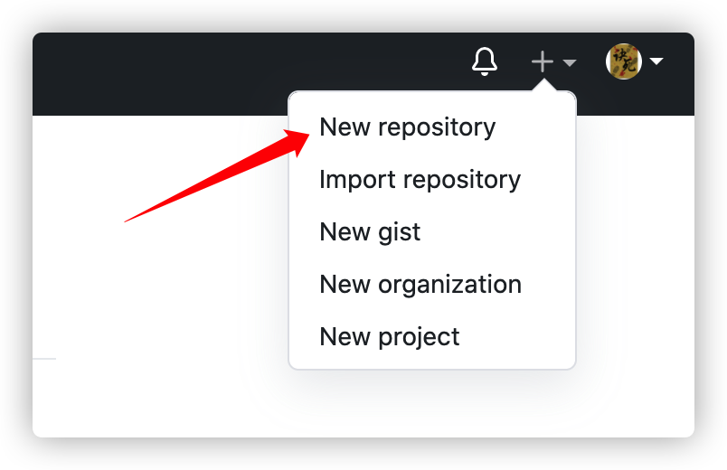

3. 填写 "Repositroy name" ，即填写仓库名称。如果有描述信息可以写下，不写也没事。

   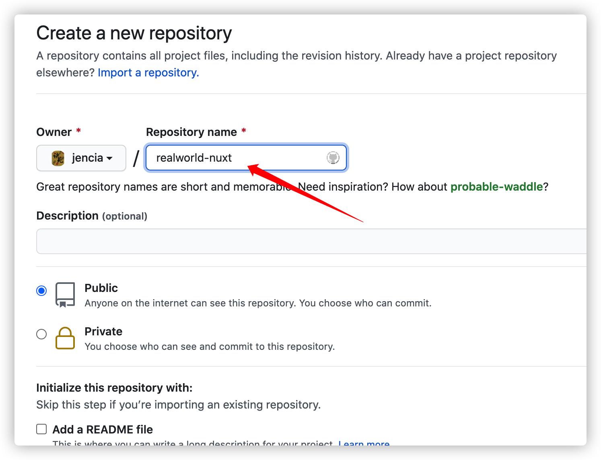

4. 点下面的 “Create repository” 按钮创建仓库，到这里就完成了。

#### 创建 Token

1. 进入个人设置界面

   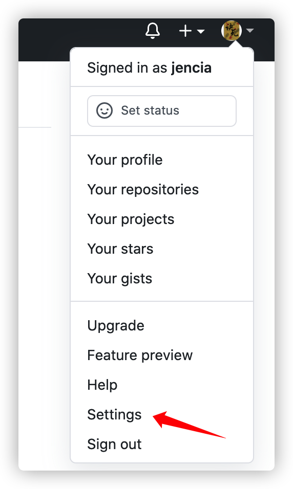

2. 在个人设置页面里点击侧边栏菜单的 "Developer setting" 进入开发者设置界面

   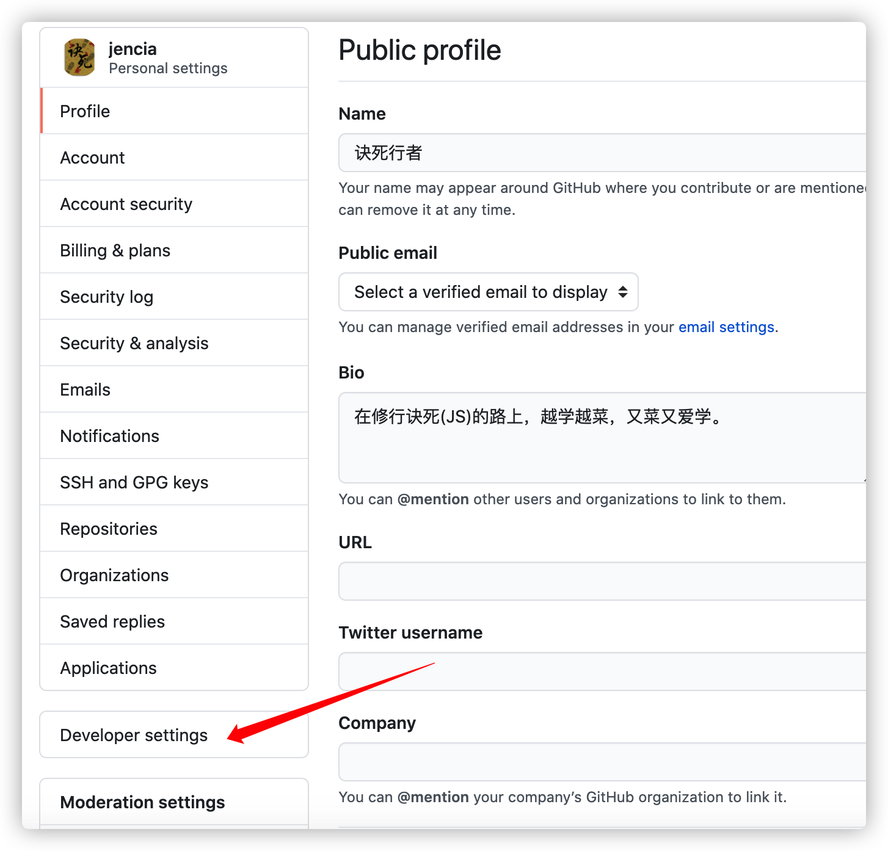

3. 在开发者设置界面里，点击侧边栏菜单的 “Personal access tokens” 进入 token 列表页，然后再点击 “Generate new token” 生成一个新 token

   

4. 在输入框里填写 token 名称（项目名 + Token），选择开放的权限，这边只需开通 `repo` 权限就好。

   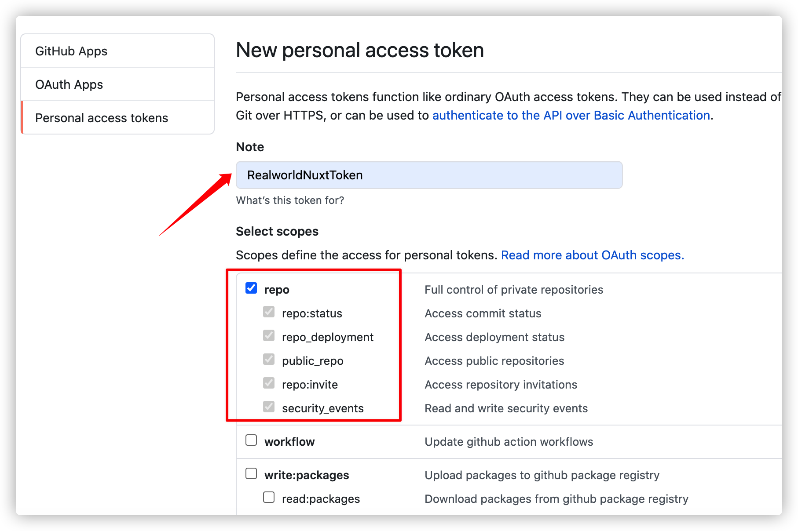

5. 然后拉到最底下，点击 “Generate token” 按钮
   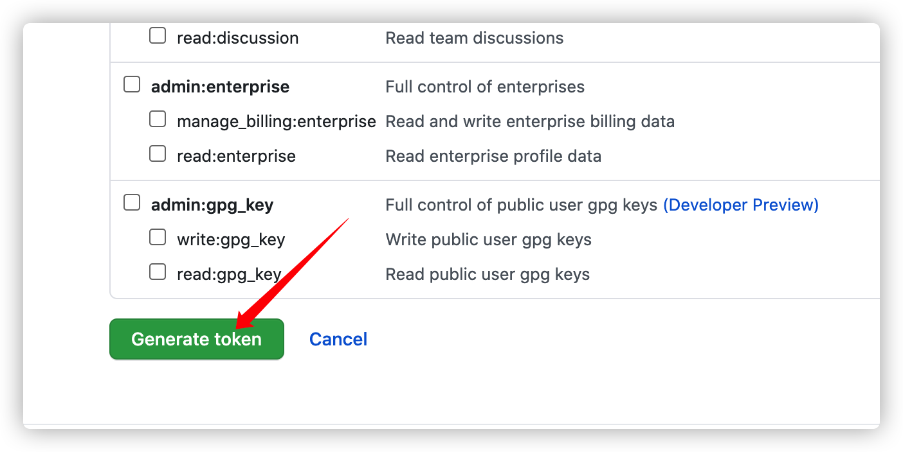

6. 创建完 token 后会回到 token 列表页面，这时候列表的第一个就是刚才创建的 token，token 的值只展示一次，后续都看不到，所以这边要先复制一份。

   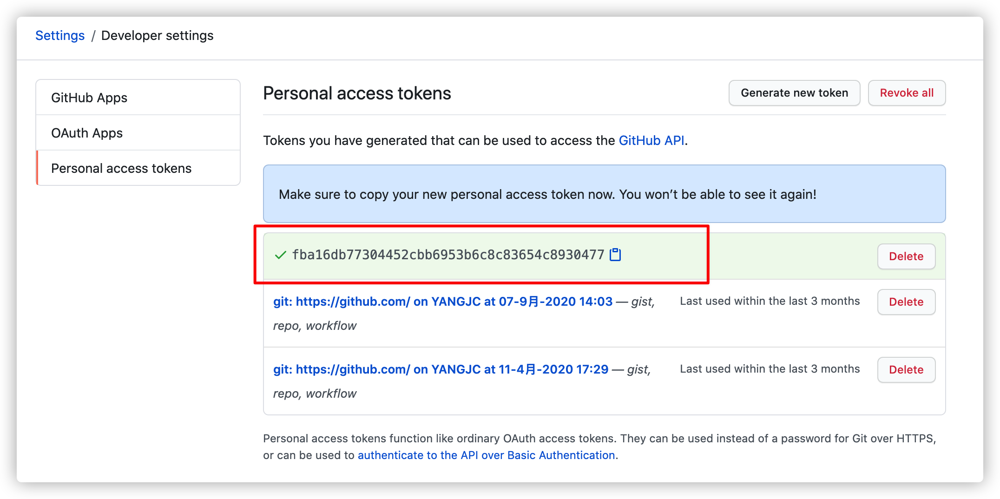

#### 配置密钥

1. 进入刚才的创建的仓库，点击 `Settings -> Secrets -> New repository secret` 创建仓库密钥。

   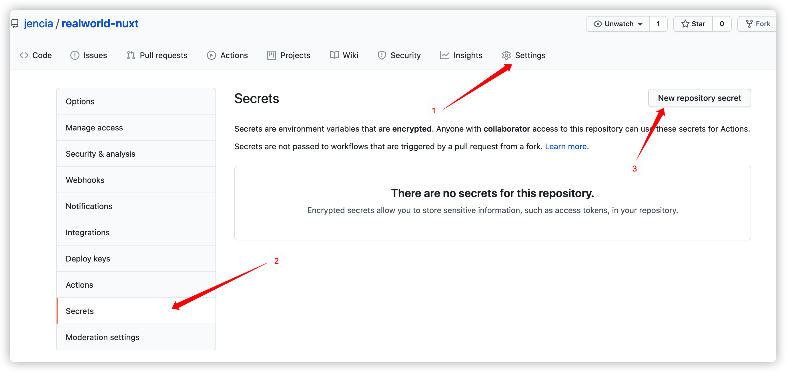

2. 输入 `name` 和 `value` 值，点击 “Add secret” 创建密钥

   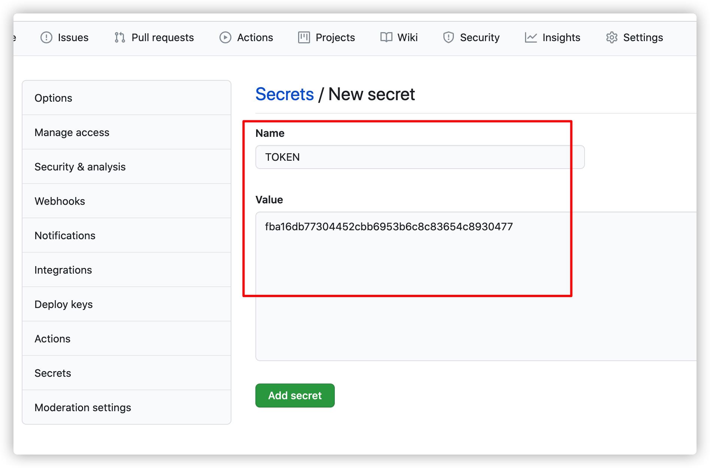

3.  然后就能看到刚添加的密钥

   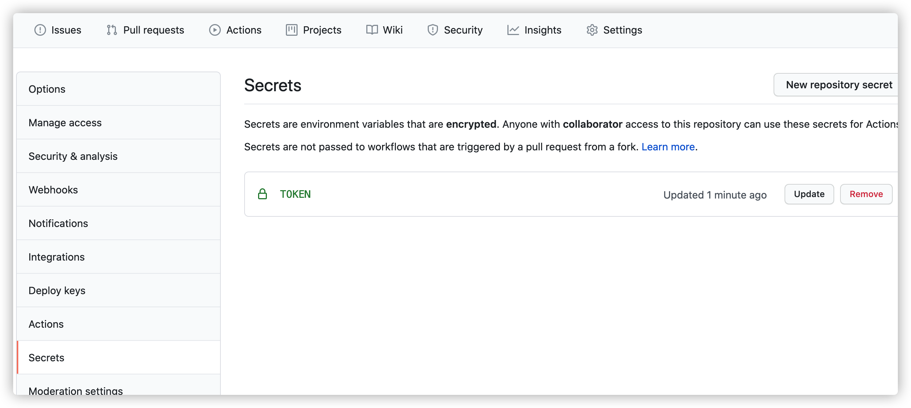

4. 后续登录服务器还需要用到一些变量信息：

   - 域名或公网IP (HOST) : `jswalk.com`
   - 用户名 (USERNAME) : `root`
   - 密钥 (KEY) : 公钥文件内容
   - SSH端口 (PORT) : 22

   以同样的步骤将每个数据配置为密钥：

   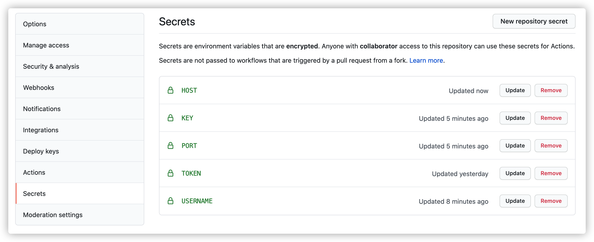

#### 配置部署文件

这边以 NuxtJS 项目为例，首先需要做一些部署前的配置，配置跟 [手动部署](NuxtJS 项目部署) 的一样，只是命令行要换种写法。

在项目根目录下创建 `.github/workflows/main.yml` 文件：

```yaml
name: 发布和部署
on:
  push:
    tags:
      - 'v*'

jobs:
  build-and-deploy:
    name: 发布和部署
    runs-on: ubuntu-latest
    steps:

    - name: 拉取项目
      uses: actions/checkout@master
    - name: 打包构建
      uses: actions/setup-node@master
      with:
        node-version: '12.x'

    - name: 安装依赖
      run: yarn
    - name: 构建
      run: yarn build
    - name: 打包
      run: tar -zcvf release.tgz .nuxt static nuxt.config.js package.json pm2.config.json yarn.lock

    - name: 发布
      id: create_release
      uses: actions/create-release@master
      env:
        GITHUB_TOKEN: ${{ secrets.TOKEN }}
      with:
        tag_name: ${{ github.ref }}
        release_name: Release ${{ github.ref }}
        draft: false
        prerelease: false

    - name: 上传
      id: upload-release-asset
      uses: actions/upload-release-asset@master
      env:
        GITHUB_TOKEN: ${{ secrets.TOKEN }}
      with:
        upload_url: ${{ steps.create_release.outputs.upload_url }}
        asset_path: ./release.tgz
        asset_name: release.tgz
        asset_content_type: application/x-tgz

    - name: 部署
      uses: appleboy/ssh-action@master
      with:
        host: ${{ secrets.HOST }}
        username: ${{ secrets.USERNAME }}
        key: ${{ secrets.KEY }}
        port: ${{ secrets.PORT }}
        script: |
          cd /root/task/node-project
          rm -rf realworld-nuxt
          mkdir realworld-nuxt
          cd realworld-nuxt
          wget https://github.com/jencia/realworld-nuxt/releases/latest/download/release.tgz
          tar -zxvf release.tgz
          rm -f release.tgz
          yarn
          pm2 reload pm2.config.json

```

Github 会去读取 `.github/workflows` 目录下的文件所有 `yml` 或 `yaml` 文件，一个文件就是一个 action，每个action 分为 `on` 和 `jobs` 两部分：

- `on` 是触发这个 action 的事件
- `jobs` 是具体要执行的内容

以下详细讲解下每段代码：

```yml
on:
  push:
    tags:
      - 'v*'
```

这边的事件触发者是 `push`，这个 `push` 指的就是 git 里面的 `git push` 。也就是说执行 `git push` 命令后触发 action。但不是所有的 `push` 都会触发，下一行给出了条件，`tags` 就是执行 `push` 时带上 `--tags` 参数。针对 `tags` 又给出了条件，就是打过标签的，也就是执行过 `git tag <tagName>` 操作，且 `tagName` 值是以 `v` 开头的值。满足了以上要求就去触发 action，总的来说跟以往的变化就是：

```sh
$ git add .
$ git commit -m '...'

# 这边要打上一个版本号标签
$ git tag v0.1.0

# 提交时要带上 --tags 参数
$ git push --tags
```

执行这些操作前，确保已经关联远程仓库了，也就是执行过以下命令：

```sh
$ git remote add origin <url>
$ git push -u origin master
```

当 action 被触发后，你就可以在 Github 上看到进度，进到对应的项目页面里，点击 "Actions"，页面跳转过去后点击 "发布和部署" (这名称根据配置展示的)，再点击最新的工作流。

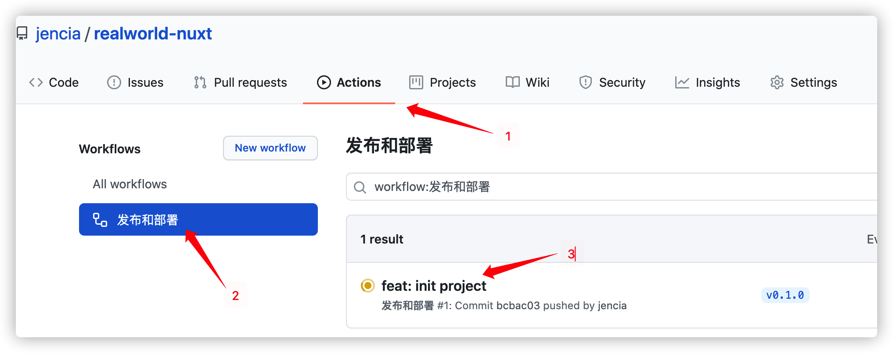

页面跳转过去再点击左侧的 “发布和部署”，这时候在右侧就能看到进度了。


当全部任务都呈现打勾状态的时候，就代表部署完成了。

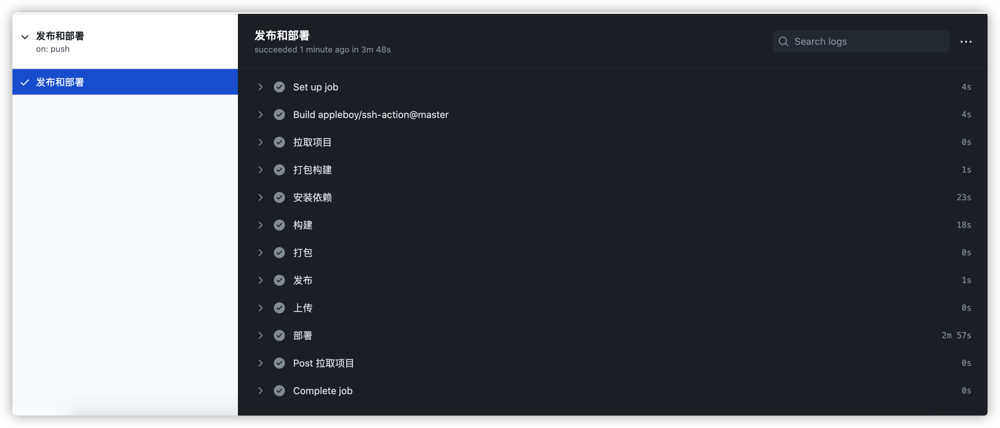

接下来说下 action 具体执行的内容。

```yaml
jobs:
  build-and-deploy:
    name: 发布和部署
    runs-on: ubuntu-latest
    steps:
```

- `jobs` 是固定的，表示后续属于工作流内容
- `jobs` 下一行是一个 ID 名称，一般是给整个工作流取个英文名

- `name` 是 ID 的别名，会展示在页面上的名称，所以可以取个中文名
- `runs-on` 是个必填项，工作流的操作都会放在 Github 的托管平台上操作，而 `runs-on` 就是指定托管平台的运行系统和版本号，这边是指定使用 `ubuntu` 最新版系统。
- `steps` 就是写工作流内容的地方

工作流由多个任务组成，每个任务由 `-` 开头，例如：

```yaml
- name: 安装依赖
  run: yarn
- name: 构建
  run: yarn build
- name: 打包
  run: tar -zcvf release.tgz
```

这边表示执行了三个任务， `name` 给任务取个名字，`run` 是要执行的命令。在触发 action 后每个任务都会出现在 Github 工作量进度中：

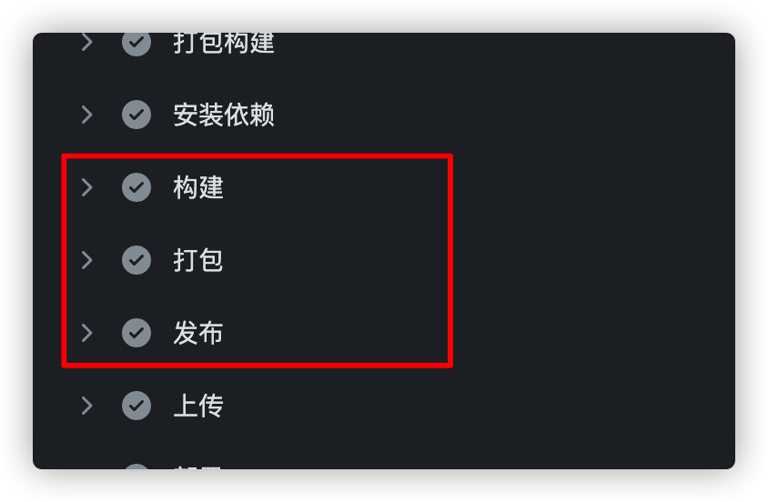

`run` 也可以执行多条命令：

```yaml
- name: 安装依赖并构建
  run: |
    yarn install
    yarn build
```

Github 有提供了一些内置的操作，或者说是封装好的代码单元，通过 `uses` 使用，例如：

```yaml
- name: 发布
  id: create_release
  uses: actions/create-release@master
  env:
    GITHUB_TOKEN: ${{ secrets.TOKEN }}
  with:
    tag_name: ${{ github.ref }}
    release_name: Release ${{ github.ref }}
    draft: false
    prerelease: false
```

这边使用了 `actions/create-release@master` 代码单元，通过 `env` 配置环境变量，通过  `with` 向代码单元传递参数。设置 `id` 是为了让后面的操作访问这边的数据。

这边用到的代码代码单元的作用分别是：

- `actions/checkout` 用于拉取项目
- `actions/setup-node` 让托管平台拥有 NodeJS 开发环境，这里面也包含 Yarn 环境
- `actions/create-release` 用于在 Github 上创建 `release` 包 
- `actions/upload-release-asset` 上传包文件
- `appleboy/ssh-action` 使用 SSH 登录服务器，并执行一些命令

`main.yml` 文件代码用到的内容大概就这些，更多语法内容可以查看 [工作流语法文档](https://docs.github.com/cn/free-pro-team@latest/actions/reference/workflow-syntax-for-github-actions) 。