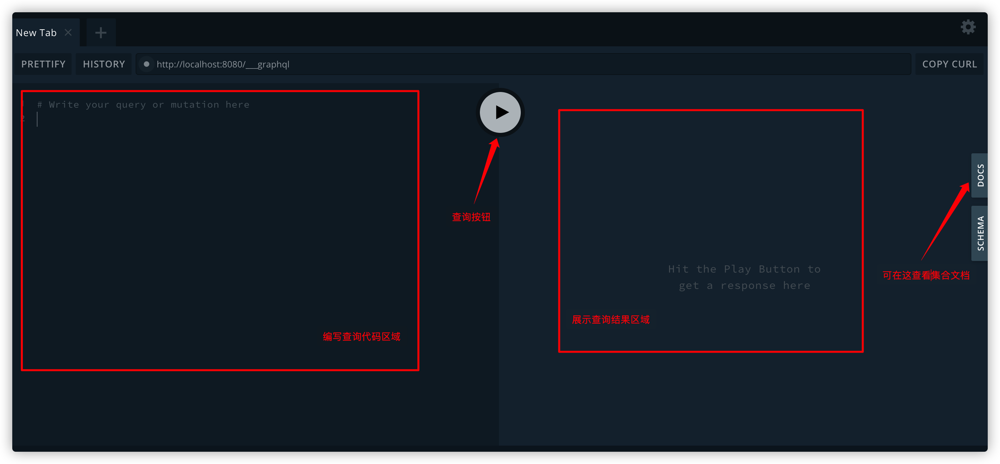
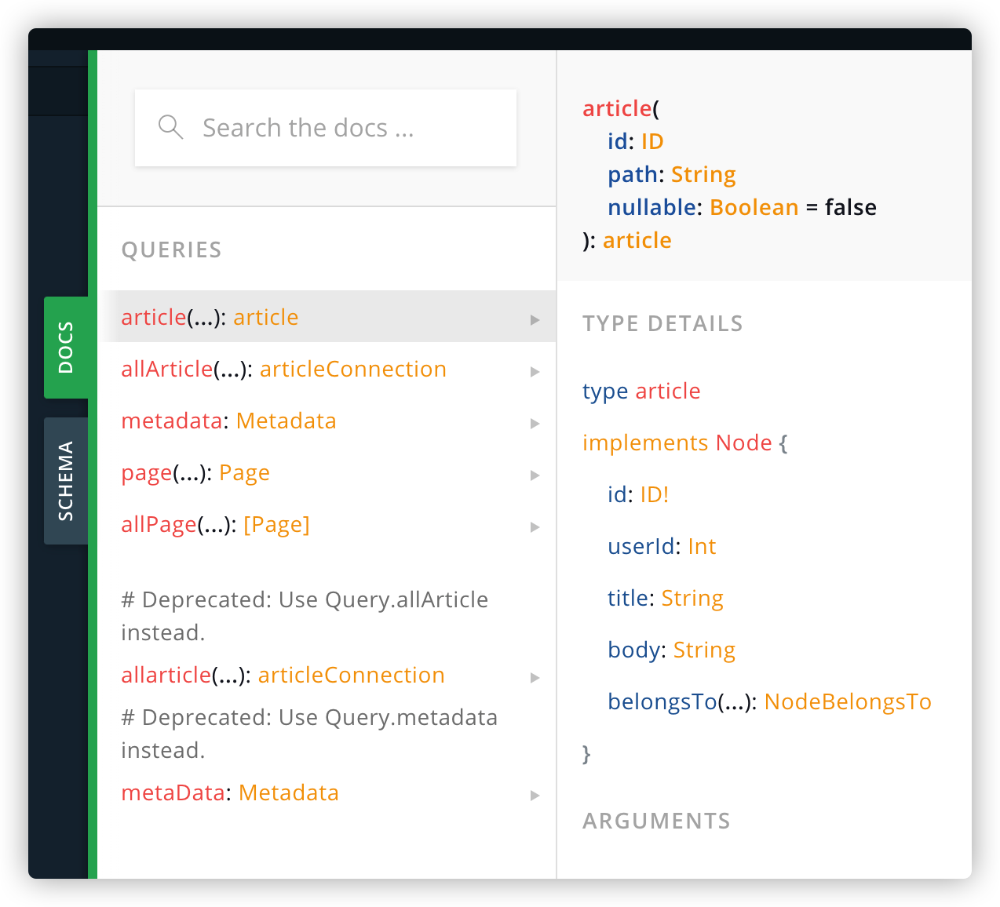

# Gridsome

Gridsome 让开发人员可以轻松地构建静态生成的网站和应用程。

官网：[https://gridsome.org/](https://gridsome.org/)

中文官网：[https://www.gridsome.cn/](https://www.gridsome.cn/)

## 快速入门

1. 安装

```sh
$ yarn global add @gridsome/cli
```

2. 创建项目

```sh
$ gridsome create my-gridsome-site
$ cd my-gridsome-site
```

3. 启动项目

```sh
$ yarn run develop
```

## 项目配置

针对 `gridsome.config.js` 配置项讲解。

文件导出一个配置对象，例如：

```js
module.exports = {
  siteName: 'Gridsome',
  siteUrl: 'https://www.gridsome.org',
  plugins: []
}
```

- siteName

    网站名称设置，默认取项目目录名称。

    模板项目里默认有两个地方使用：

    第一是页面 `title`，例如首页的页面标题默认是 `Hello, world! - Gridsome` ，这里的 `Gridsome` 就是取 `siteName` 的值。

    第二是布局组件，头部左边的链接文本，也就是通过 `$static.metadata.siteName` 取值。

- siteDescription

    网站描述设置，设置的值将作为 `<meta name="description" content="" />` 的 `content` 值存在。

- pathPrefix

    作为项目文根，即项目访问地址基本路径，只在生产环境下生效。

- titleTemplate

    页面 `title` 文本格式，默认 `%s - <siteName>`

其他查看 [官方文档配置说明](https://www.gridsome.cn/docs/config/)

## Pages

创建页面有两种方式：文件系统和 Pages API

- 文件系统

    按照规则创建文件自动生成路由配置，生成规则：

    - `src/pages/Index.vue` => `/`
    - `src/pages/AboutUs.vue` => `/about-us`
    - `src/pages/about/Vision.vue` => `/about/vision`
    - `src/pages/blog/Index.vue` => `/blog`
    - `src/pages/user/[id].vue` => `/user/:id`
    - `src/pages/user/[id]/settings.vue` => `/user/:id/settings`

- Pages API

    在 `gridsome.server.js` 配置：

    ```js
    module.exports = function (api) {
        api.createPages(({ createPage }) => {
            createPage({
                path: '/my-page',
                component: './src/templates/MyPage.vue'
            })
            createPage({
                path: '/user/:id(\\d+)',
                component: './src/templates/User.vue'
            })
        })
    }
    ```

> 如果使用动态路由，例如 `[id].vue` 最终生成的文件名称叫 `_id.html` ，如果不希望是这样的名称可以去重写规则。

每个页面都可以有自己的 meta 信息，可以在页面组件 `.vue` 文件里设置：

```js
export default {
  metaInfo: {
    title: 'Hello, world!',
    meta: [
      { name: 'author', content: 'John Doe' }
    ]
  }
}
```

## 集合

### 添加集合

在 `gridsome.server.js` 里添加集合数据

```js
const axios = require('axios')

module.exports = function (api) {
    api.loadSource(async ({ addCollection }) => {
        // 添加集合数据，取名为 article，同时会自动生成 allArticle
        const collection = addCollection('article')

        // 预请求数据
        const { data } = await axios.get('http://jsonplaceholder.typicode.com/posts')

        // 将数据作为节点添加到集合里
        data.forEach(item => {
            collection.addNode(item)
        })
    })
}
```

### 在 GraphQL 查询数据

启动项目后会打印出这样的信息：

```sh
$ yarn run develop

Site running at:                                         
  - Local:                 http://localhost:8080/          
  - Network:               http://192.168.31.166:8080/     
                                                           
  Explore GraphQL data at: http://localhost:8080/___explore
```

其中 `http://localhost:8080/___explore` 就是 `GraphQL` 查询页面的地址，只有开发环境可以访问到。打开页面后可以看到这样的界面：



点击右侧的 “DOCS” 后可以看到这样的界面：



QUERIES 下是当前拥有的集合，`article` 和 `allArticle` 是刚才加的，其他几个是自带的。点击 `article` 可以看到集合的相关信息，其中 Node 里面就是集合项的数据结构。

`article` 的查询语句：

```
query {
    article (id: 1) {
        id
        title
        body
    }
}
```

`allArticle` 的查询语句：

```
query {
    allArticle {
        edges {
            node {
                id
                title
                body
            }
        }
    }
}
```

### 在页面中查询数据

创建 `./src/pages/ArticleList.vue` 文件：

```html
<template>
    <ul>
        <li v-for="article in $page.allArticle.edges" :key="article.node.id">
            <g-link :to="`/article-detail/${article.node.id}`">{{ article.node.title }}</g-link>
        </li>
    </ul>
</template>

<page-query>
query {
    allArticle {
        edges {
            node {
                id
                title
            }
        }
    }
}
</page-query>
```

添加一个跟 `<template>` 平级的标签 `<page-query>` ，在里面写 GraphQL 代码。这边直接将上一节的 `allArticle` 查询语句拷贝过来。

GraphQL 语句通过 `this.$page` 对象拿到查询到的数据，默认 `this.$page`里的数据结构跟 GraphQL 查询语句一样，变量名称也一样。例如查询的集合是 `allArticle` ，查询到的数据将放在 `this.$page.allArticle` ，如果想改成 `this.$page.articleList` ，可以给查询语句加上别名：

```
query {
    articleList: allArticle {
        edges {
            node {
                id
                title
                body
            }
        }
    }
}
```

### 使用模板渲染节点页面

对于文章详情页面，需要查询单条数据，这时候需要传入 ID 进行查询。想要让 GraphQL 里的集合接收到外部传来参数，需要给这个结合配置模板节点。配置模板节点就类似于配置路由一样，配置写在 `gridsome.config.js` 文件里，例如我准备需要开发一个文章详情页面，文章详情查的是 `article` 集合里的数据，配置如下：

```js
module.exports = {
    templates: {
        article: [
            {
                path: '/article-detail/:id',
                component: './src/templates/ArticleDetail.vue'
            }      
        ]
    }
}
```

`templates` 是用来配置模板节点的，`template` 下的 `article` 是集合名称，一个集合下可以配多个节点。节点的配置类似路由配置一样配置动态路由，配置 `:id` 就能在 GraphQL 里接收到名为 `id` 的参数。组件指向 `src/templates` 下的组件，`src/templates` 目录就是专门存放节点模板的，组件的写法跟一般的页面组件没什么区别，以下是组件代码：

```html
<template>
    <div>
        <h3>{{ $page.article.title }}</h3>
        <p>{{ $page.article.body }}</p>
    </div>
</template>

<page-query>
query ($id: ID!) {
    article (id: $id) {
        title
        body
    }
}
</page-query>
```

参数在 `query` 上传递，`$id` 以 `$` 开头表示这是一个变量，`id` 对应模板节点传过来的 `id` 。`: ID` 的写法跟 TypeScript 一样后面跟上参数的数据类型，`ID` 表示唯一值的数据类型，后面加上 `!` 表示这是必填的。

`article (id: $id)` 是 GraphQL 中的语法，表示传入一个参数 `id` 值为 `$id` 的数据进行查询，`$id` 就是引入上面定义的变量。

### 分页处理

针对上面写的 `ArticleList` 页面的查询语句做调整：

```diff
-   query {
+   query ($page: Int)  {
-       allArticle {
+       allArticle (perPage: 10, page: $page) @paginate {
+           pageInfo {
+               currentPage
+               totalPages
+           }
            edges {
                node {
                    id
                    title
                }
            }
        }
    }
```

1. `query` 接收 `$page` 数据
2. `allArticle` 传入 `perPage` (每页数据量) 、`page` (当前第几页) 参数
3. 加入 `@paginate` 指令，作用是将页面转成模板节点，使得 `$page` 能够接收到数据
4. 查询数据添加 `currentPage` 和 `totalPages` 数据，这两个数据是分页组件所必须的数据

Gridsome 为我们提供了分页组件，使用方式如下：

```html
<template>
    <div>
        ...
        <Pager :info="$page.articleList.pageInfo" />
    </div>
</template>

<script>
import { Pager } from 'gridsome'

export default {
    components: { Pager }
}
</script>
```
